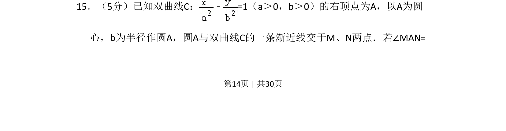
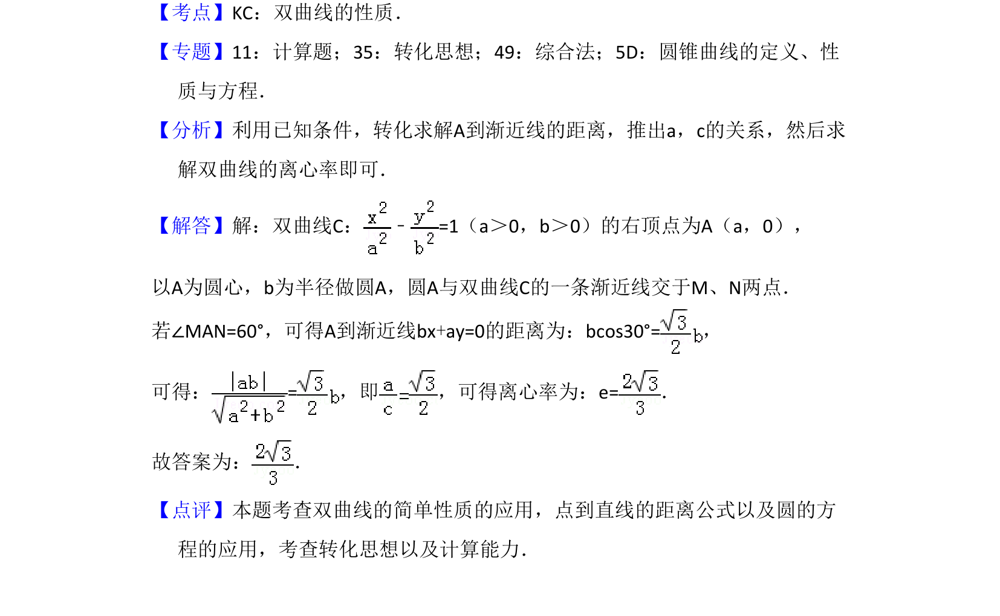

## 题面

## 摘要

双曲线与圆相交问题，结合渐近线求角度关系

## 关联考点

- [[368-双曲线定义与方程|双曲线]]
- [[220-圆-定义|圆]]
- [[369-双曲线渐近线|渐近线]]
- [[1111-解析几何|解析几何]]

## 答案与解析

> 📄 原 PDF 第 14 页：`素材/真题/湖南/2008-2024·（湖南）数学高考真题/2017年高考数学试卷（理）（新课标Ⅰ）（解析卷）.pdf`
