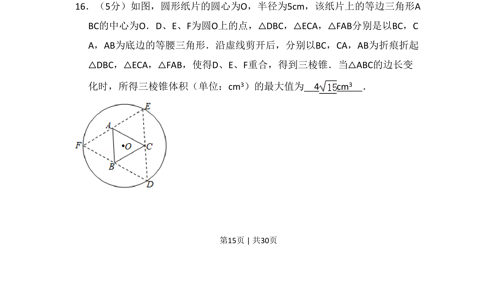
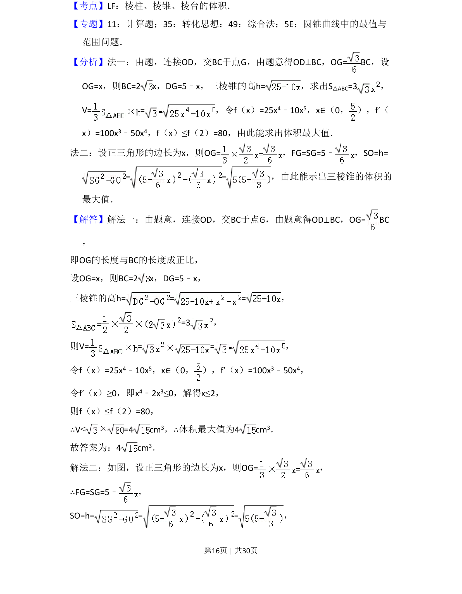
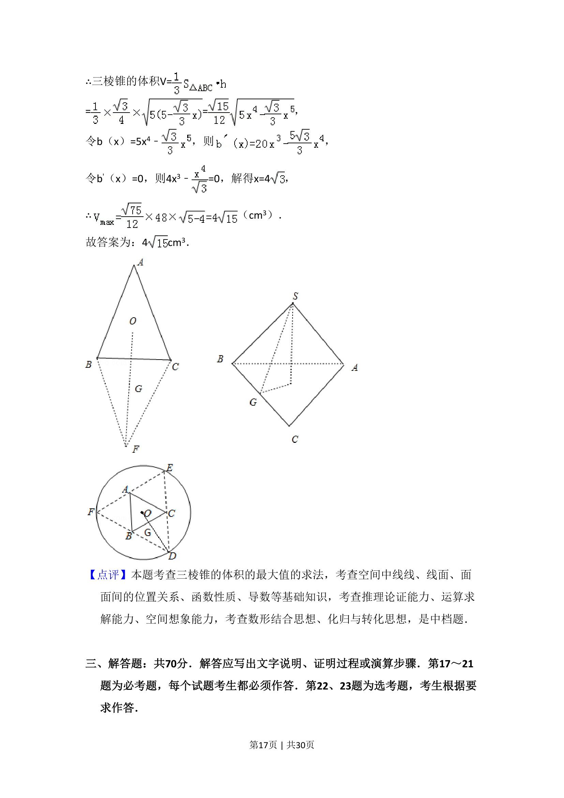

## 题面

## 摘要

折叠圆形纸片为三棱锥，求体积最大值。

## 关联考点

- [[1055-立体几何|立体几何]]
- [[1191-三棱锥体积|三棱锥体积]]
- [[913-最值问题|最值问题]]
- [[函数思想]]

## 答案与解析

> 📄 原 PDF 第 15 页：`素材/真题/湖南/2008-2024·（湖南）数学高考真题/2017年高考数学试卷（理）（新课标Ⅰ）（解析卷）.pdf`
