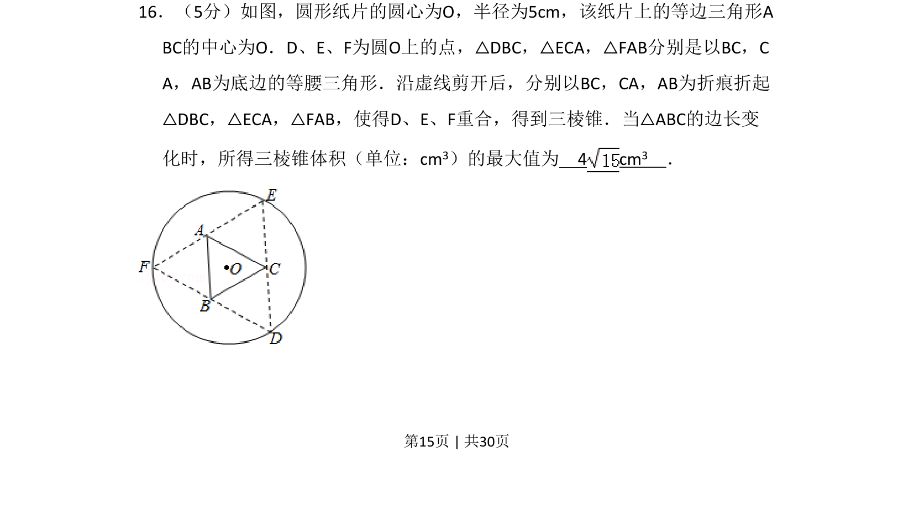
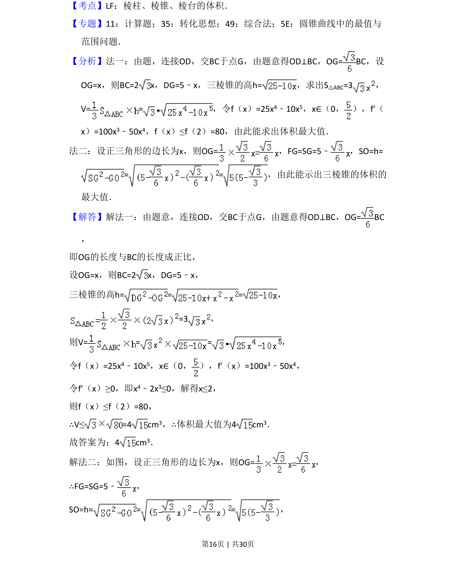
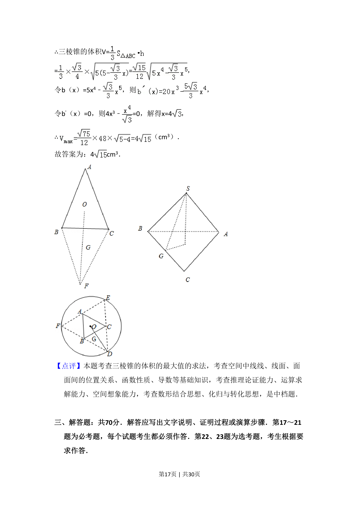

## 题面

## 摘要

折叠圆形纸片为三棱锥，求体积最大值。

## 关联考点

- [[1055-立体几何|立体几何]]
- [[1191-三棱锥体积|三棱锥体积]]
- [[913-最值问题|最值问题]]
- [[函数思想]]

## 答案与解析

> 📄 原 PDF 第 15 页：`素材/真题/湖南/2008-2024·（湖南）数学高考真题/2017年高考数学试卷（理）（新课标Ⅰ）（解析卷）.pdf`

<!-- 题干文本-start -->
## 题干文本
16．（5分）如图，圆形纸片的圆心为O，半径为5cm，该纸片上的等边三角形A
BC的中心为O．D、E、F为圆O上的点，△DBC，△ECA，△FAB分别是以BC，C
A，AB为底边的等腰三角形．沿虚线剪开后，分别以BC，CA，AB为折痕折起
△DBC，△ECA，△FAB，使得D、E、F重合，得到三棱锥．当△ABC的边长变
化时，所得三棱锥体积（单位：cm3）的最大值为　4 cm3　．
<!-- 题干文本-end -->

<!-- 解析文本-start -->
## 解析文本

<!-- 解析文本-end -->
