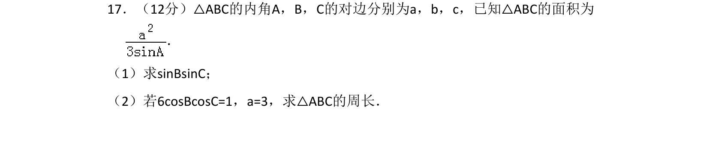
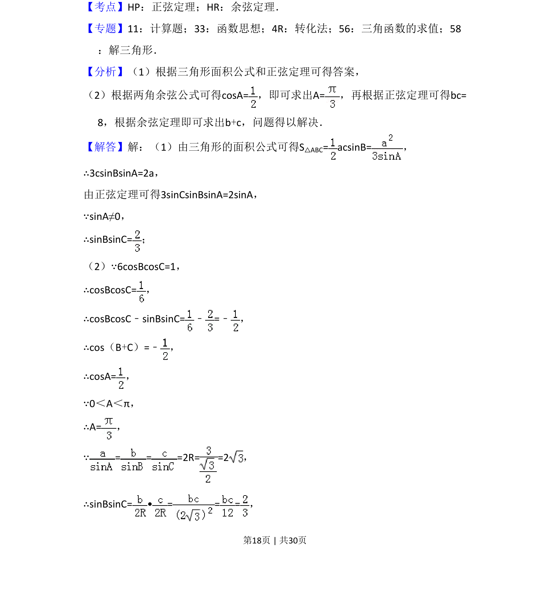
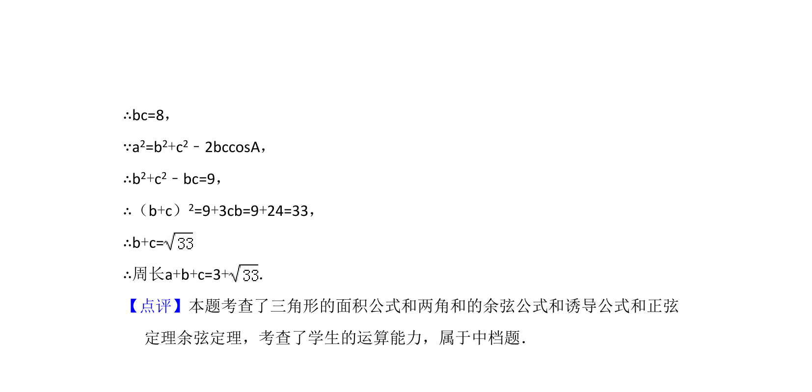

## 题面

## 摘要

利用三角形面积公式与正弦定理求三角函数值，并结合余弦定理求三角形周长。

## 关联考点

- [[126-定理|正弦定理]]
- [[126-定理|余弦定理]]
- [[272-三角恒等变换|三角恒等变换]]
- [[589-解三角形|解三角形]]

## 答案与解析

> 📄 原 PDF 第 18 页：`素材/真题/湖南/2008-2024·（湖南）数学高考真题/2017年高考数学试卷（理）（新课标Ⅰ）（解析卷）.pdf`

<!-- 题干文本-start -->
## 题干文本
17．（12分）△ABC的内角A，B，C的对边分别为a，b，c，已知△ABC的面积为
．
（1）求sinBsinC；
（2）若6cosBcosC=1，a=3，求△ABC的周长．
<!-- 题干文本-end -->

<!-- 解析文本-start -->
## 解析文本
【考点】HP：正弦定理；HR：余弦定理．菁优网版权所有
【专题】11：计算题；33：函数思想；4R：转化法；56：三角函数的求值；58
：解三角形．
【分析】（1）根据三角形面积公式和正弦定理可得答案，
（2）根据两角余弦公式可得cosA=，即可求出A=，再根据正弦定理可得bc=
8，根据余弦定理即可求出b+c，问题得以解决．
【解答】解：（1）由三角形的面积公式可得S△ABC= acsinB=，
∴3csinBsinA=2a，
由正弦定理可得3sinCsinBsinA=2sinA，
∵sinA≠0，
∴sinBsinC=；
（2）∵6cosBcosC=1，
∴cosBcosC=，
∴cosBcosC﹣sinBsinC=﹣=﹣ ，
∴cos（B+C）=﹣ ，
∴cosA=，
∵0＜A＜π，
∴A=，
∵= = =2R= =2，
∴sinBsinC= • = = =，
<!-- 解析文本-end -->
