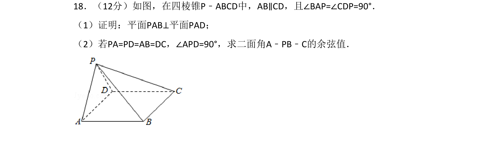
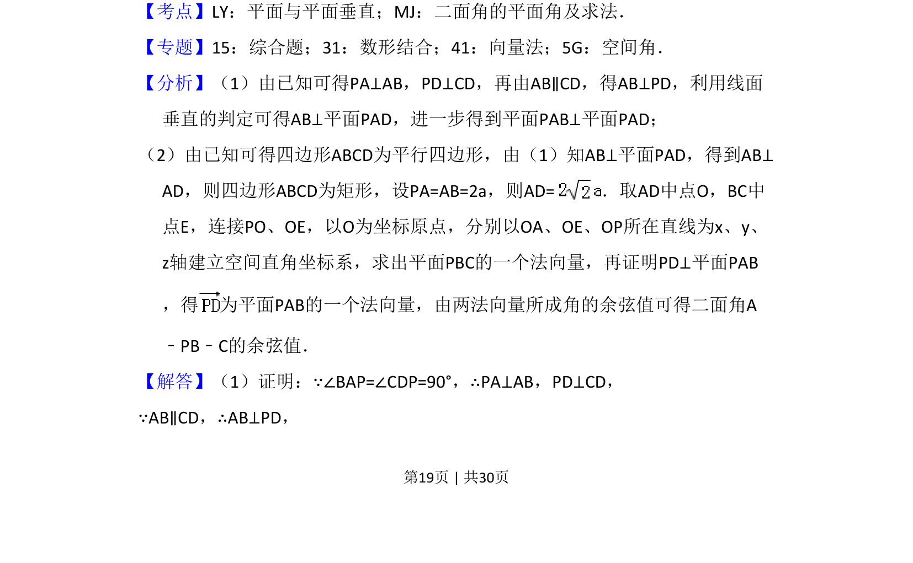
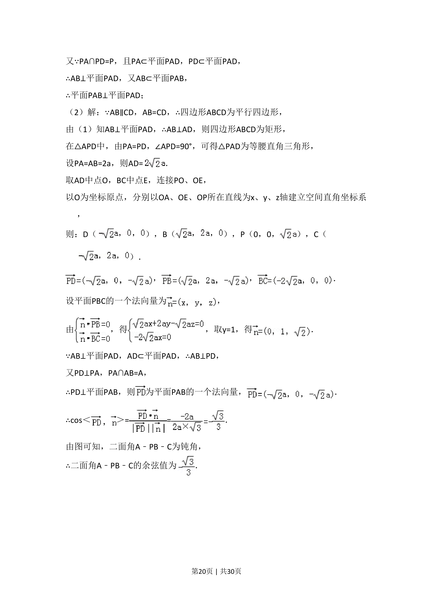
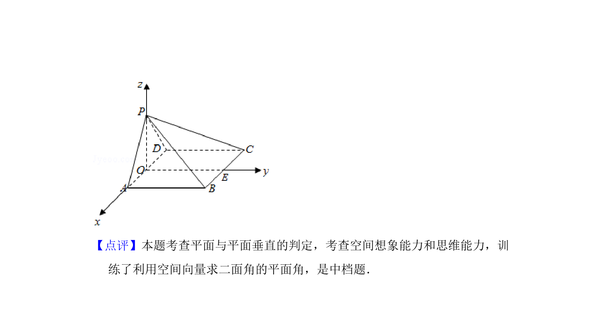

## 题面

## 摘要

在四棱锥中证明平面与平面垂直，并利用空间向量法求二面角的余弦值。

## 关联考点

- [[1149-面面垂直的判定|平面与平面垂直的判定]]
- [[643-二面角的平面角及求法|二面角的平面角及求法]]
- [[753-向量法|向量法]]

## 答案与解析

> 📄 原 PDF 第 19 页：`素材/真题/湖南/2008-2024·（湖南）数学高考真题/2017年高考数学试卷（理）（新课标Ⅰ）（解析卷）.pdf`
