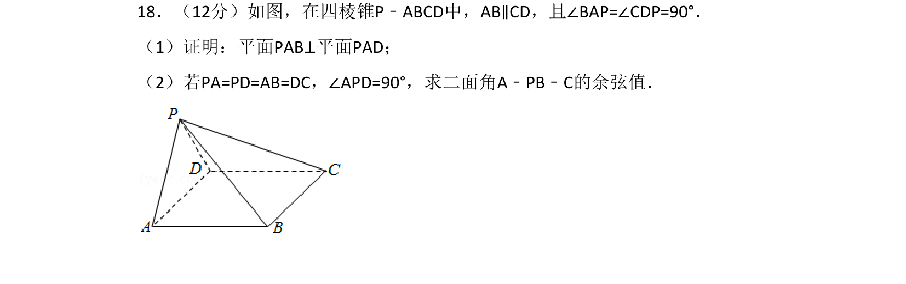
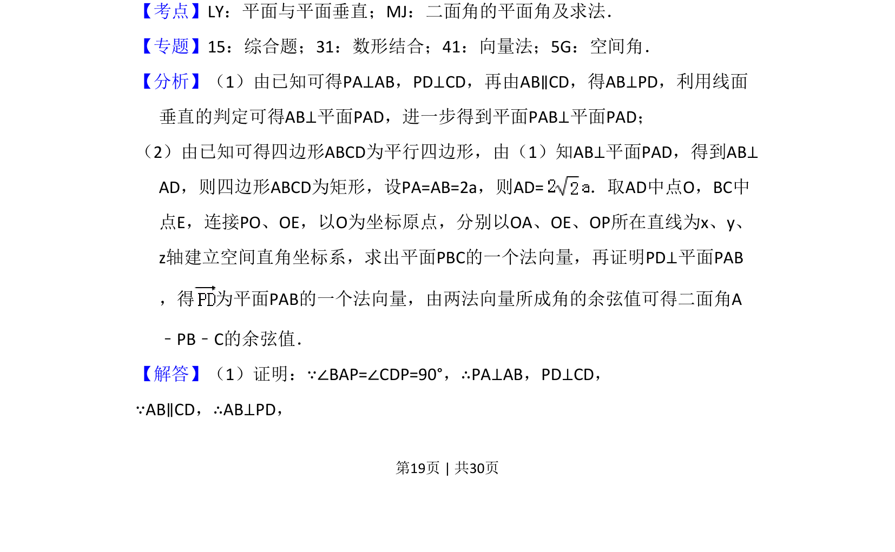
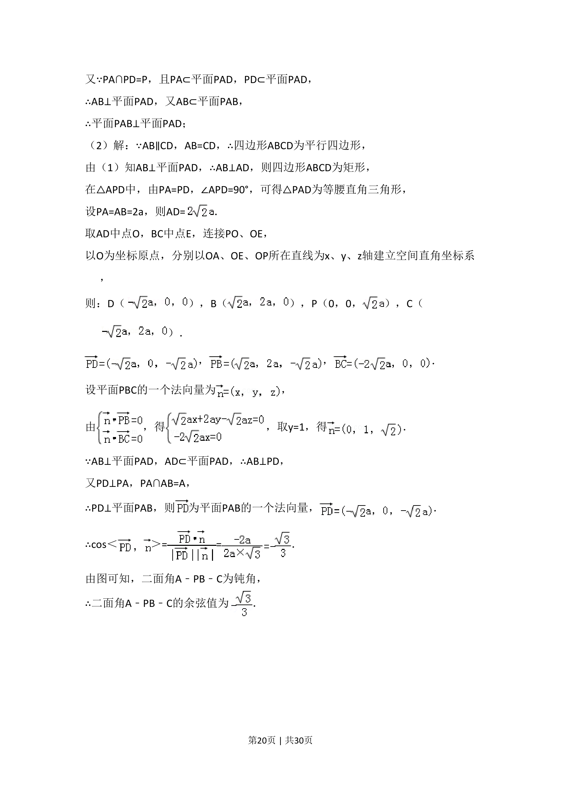
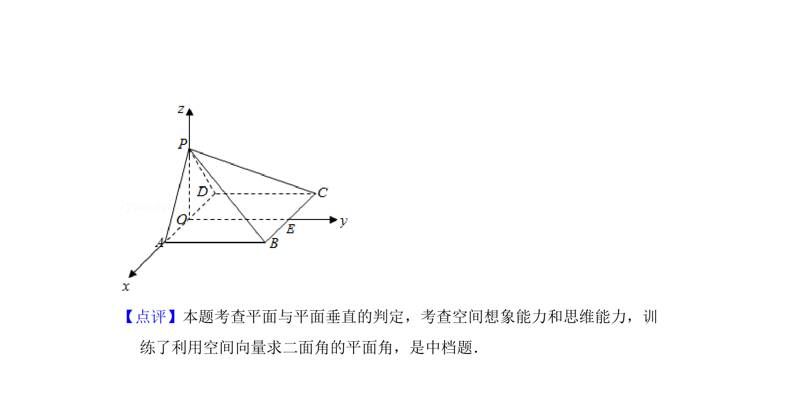

## 题面

## 摘要

在四棱锥中证明平面与平面垂直，并利用空间向量法求二面角的余弦值。

## 关联考点

- [[1149-面面垂直的判定|平面与平面垂直的判定]]
- [[643-二面角的平面角及求法|二面角的平面角及求法]]
- [[753-向量法|向量法]]

## 答案与解析

> 📄 原 PDF 第 19 页：`素材/真题/湖南/2008-2024·（湖南）数学高考真题/2017年高考数学试卷（理）（新课标Ⅰ）（解析卷）.pdf`

<!-- 题干文本-start -->
## 题干文本
18．（12分）如图，在四棱锥P﹣ABCD中，AB∥CD，且∠BAP=∠CDP=90°．
（1）证明：平面PAB⊥平面PAD；
（2）若PA=PD=AB=DC，∠APD=90°，求二面角A﹣PB﹣C的余弦值．
<!-- 题干文本-end -->

<!-- 解析文本-start -->
## 解析文本
【考点】LY：平面与平面垂直；MJ：二面角的平面角及求法．菁优网版权所有
【专题】15：综合题；31：数形结合；41：向量法；5G：空间角．
【分析】（1）由已知可得PA⊥AB，PD⊥CD，再由AB∥CD，得AB⊥PD，利用线面
垂直的判定可得AB⊥平面PAD，进一步得到平面PAB⊥平面PAD；
（2）由已知可得四边形ABCD为平行四边形，由（1）知AB⊥平面PAD，得到AB⊥
AD，则四边形ABCD为矩形，设PA=AB=2a，则AD=．取AD中点O，BC中
点E，连接PO、OE，以O为坐标原点，分别以OA、OE、OP所在直线为x、y、
z轴建立空间直角坐标系，求出平面PBC的一个法向量，再证明PD⊥平面PAB
，得 为平面PAB的一个法向量，由两法向量所成角的余弦值可得二面角A
﹣PB﹣C的余弦值．
【解答】（1）证明：∵∠BAP=∠CDP=90°，∴PA⊥AB，PD⊥CD，
∵AB∥CD，∴AB⊥PD，
<!-- 解析文本-end -->
