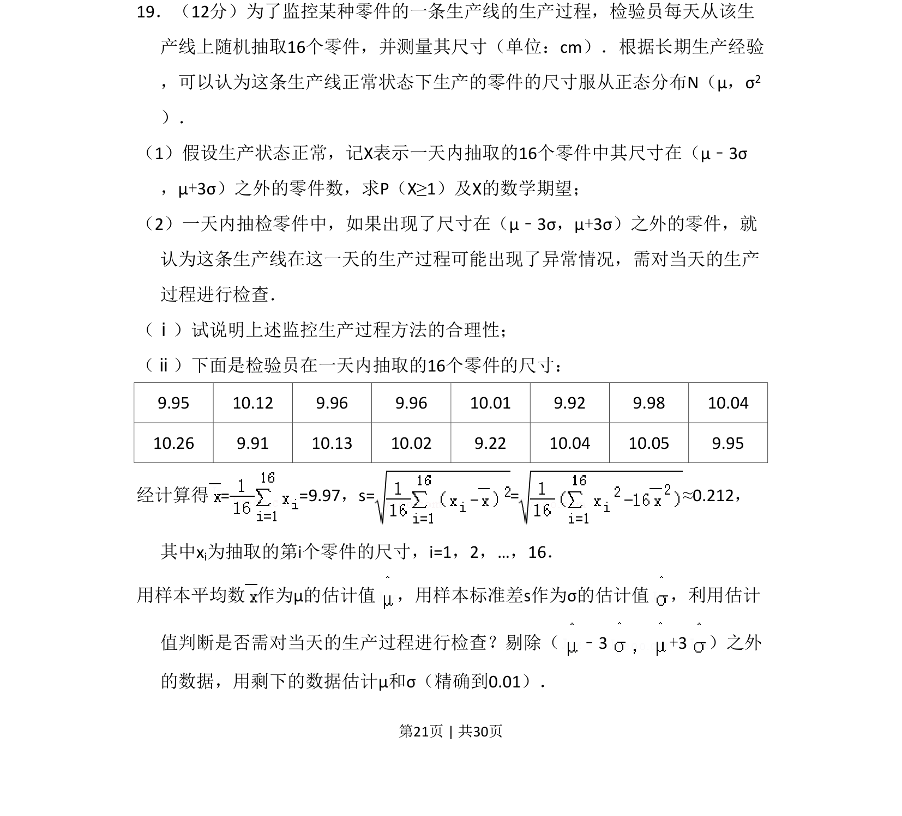
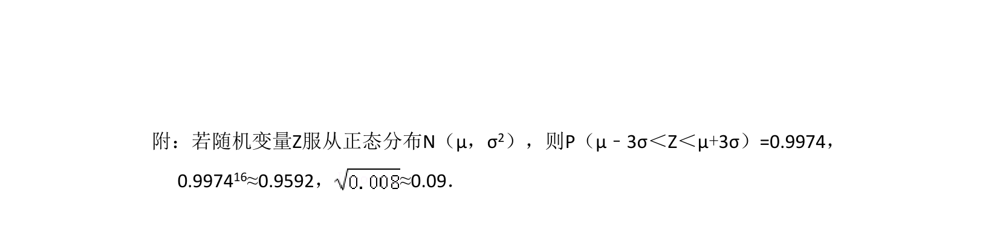
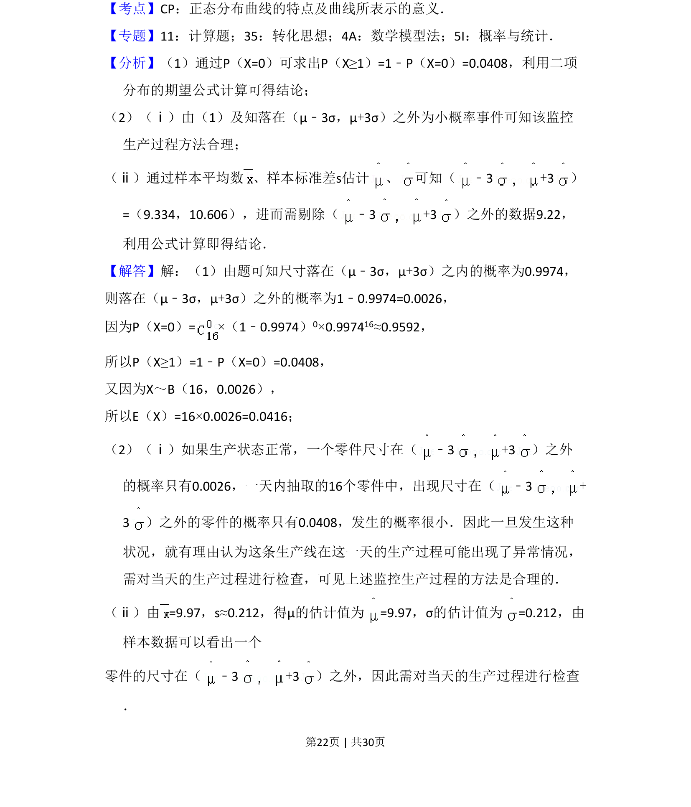
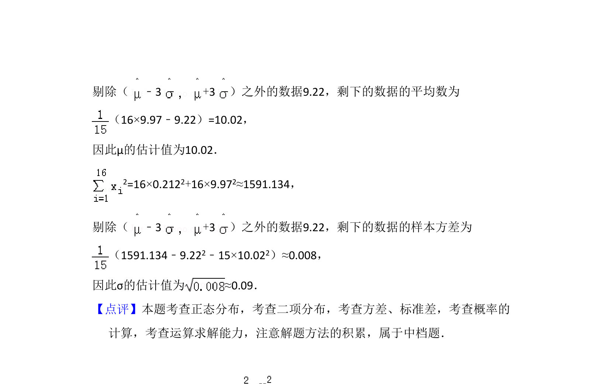

## 题面

## 摘要

正态分布与二项分布综合，利用3σ原则监控生产并估计参数，涉及数据剔除与期望计算。

## 关联考点

- [[496-正态分布概念|正态分布]]
- [[469-二项分布|二项分布]]
- [[1039-离散型随机变量的期望|数学期望]]
- [[3σ原则]]

## 答案与解析

> 📄 原 PDF 第 21 页：`素材/真题/湖南/2008-2024·（湖南）数学高考真题/2017年高考数学试卷（理）（新课标Ⅰ）（解析卷）.pdf`
