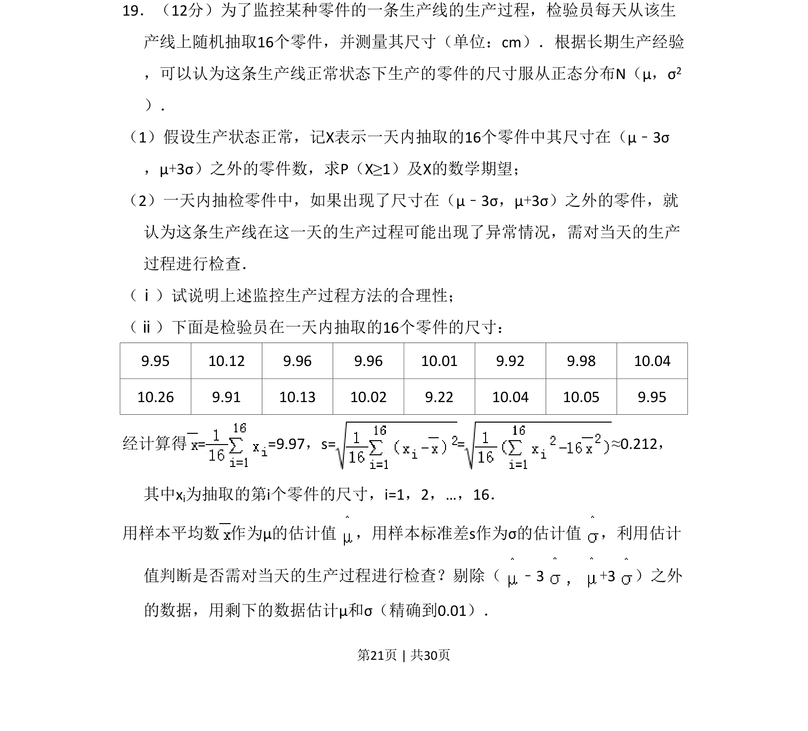
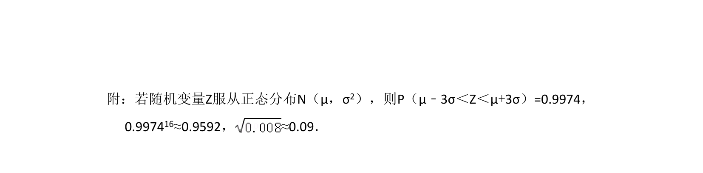
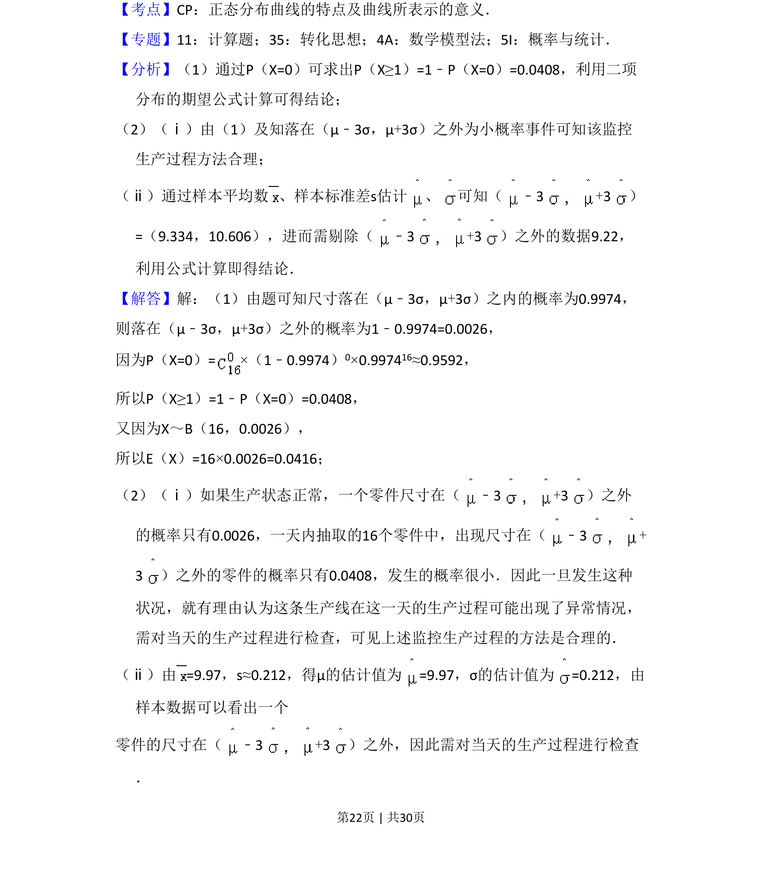
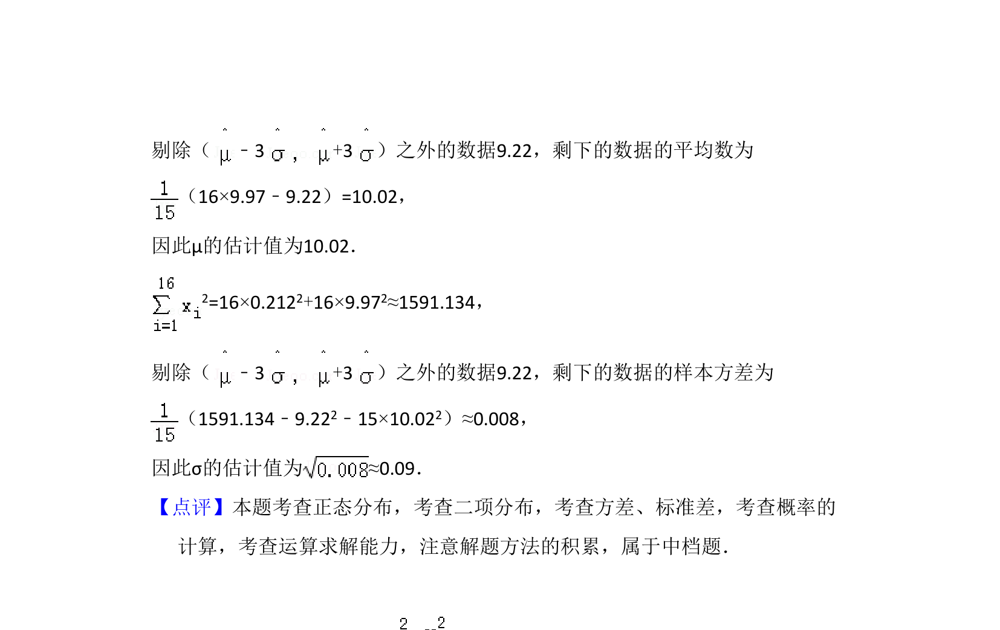

## 题面

## 摘要

正态分布与二项分布综合，利用3σ原则监控生产并估计参数，涉及数据剔除与期望计算。

## 关联考点

- [[496-正态分布概念|正态分布]]
- [[469-二项分布|二项分布]]
- [[501-离散型随机变量期望|数学期望]]
- [[1402-3σ原则|3σ原则]]

## 答案与解析

> 📄 原 PDF 第 21 页：`素材/真题/湖南/2008-2024·（湖南）数学高考真题/2017年高考数学试卷（理）（新课标Ⅰ）（解析卷）.pdf`

<!-- 题干文本-start -->
## 题干文本
19．（12分）为了监控某种零件的一条生产线的生产过程，检验员每天从该生
产线上随机抽取16个零件，并测量其尺寸（单位：cm）．根据长期生产经验
，可以认为这条生产线正常状态下生产的零件的尺寸服从正态分布N（μ，σ2
）．
（1）假设生产状态正常，记X表示一天内抽取的16个零件中其尺寸在（μ﹣3σ
，μ+3σ）之外的零件数，求P（X≥1）及X的数学期望；
（2）一天内抽检零件中，如果出现了尺寸在（μ﹣3σ，μ+3σ）之外的零件，就
认为这条生产线在这一天的生产过程可能出现了异常情况，需对当天的生产
过程进行检查．
（ⅰ）试说明上述监控生产过程方法的合理性；
（ⅱ）下面是检验员在一天内抽取的16个零件的尺寸：
9.95 10.12 9.96 9.96 10.01 9.92 9.98 10.04
10.26 9.91 10.13 10.02 9.22 10.04 10.05 9.95
经计算得= =9.97，s= =≈0.212，
其中xi为抽取的第i个零件的尺寸，i=1，2，…，16．
用样本平均数 作为μ的估计值 ，用样本标准差s作为σ的估计值 ，利用估计
值判断是否需对当天的生产过程进行检查？剔除（ ﹣3+3）之外
的数据，用剩下的数据估计μ和σ（精确到0.01）．
<!-- 题干文本-end -->

<!-- 解析文本-start -->
## 解析文本

<!-- 解析文本-end -->
