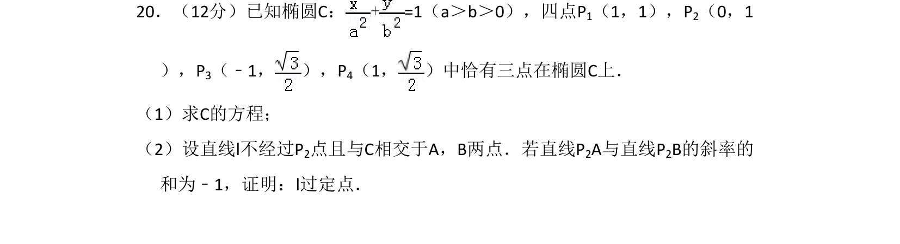
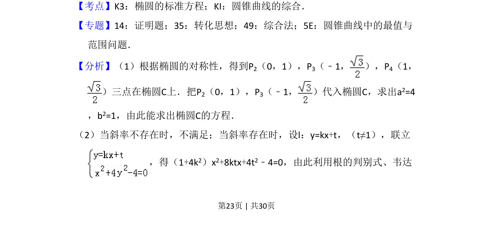
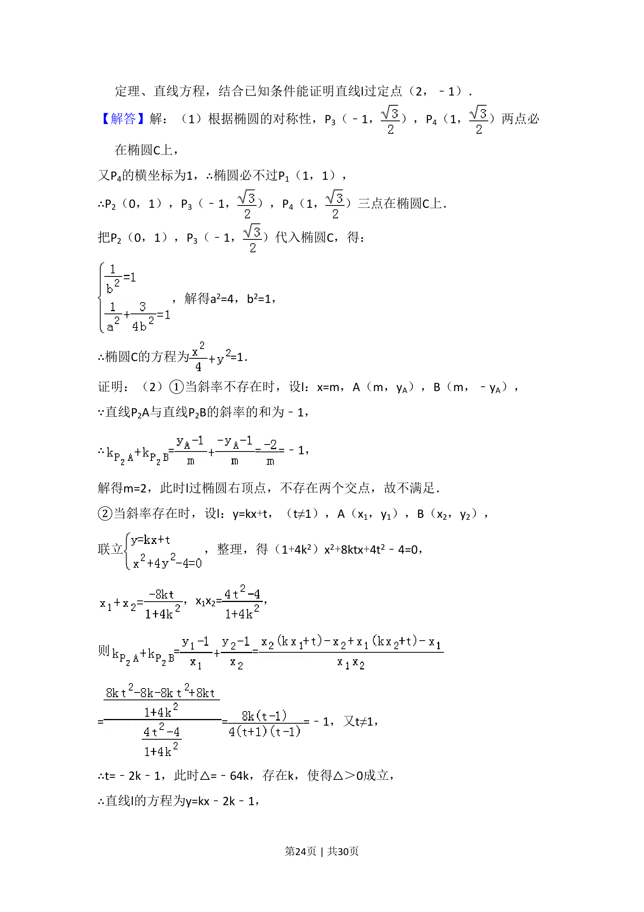
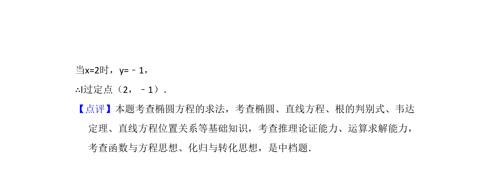

## 题面

## 摘要

根据椭圆对称性求椭圆方程，并利用斜率之和为定值证明直线过定点。

## 关联考点

- [[061-方程|椭圆的标准方程]]
- [[785-圆锥曲线的综合|圆锥曲线的综合]]
- [[015-位置|直线与椭圆的位置关系]]

## 答案与解析

> 📄 原 PDF 第 23 页：`素材/真题/湖南/2008-2024·（湖南）数学高考真题/2017年高考数学试卷（理）（新课标Ⅰ）（解析卷）.pdf`
