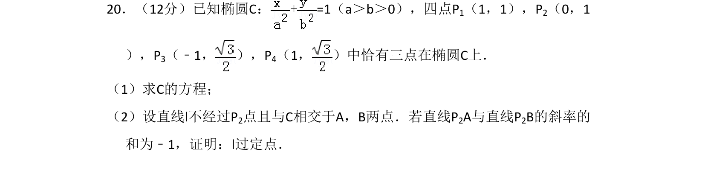
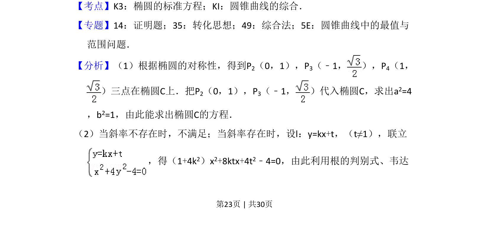
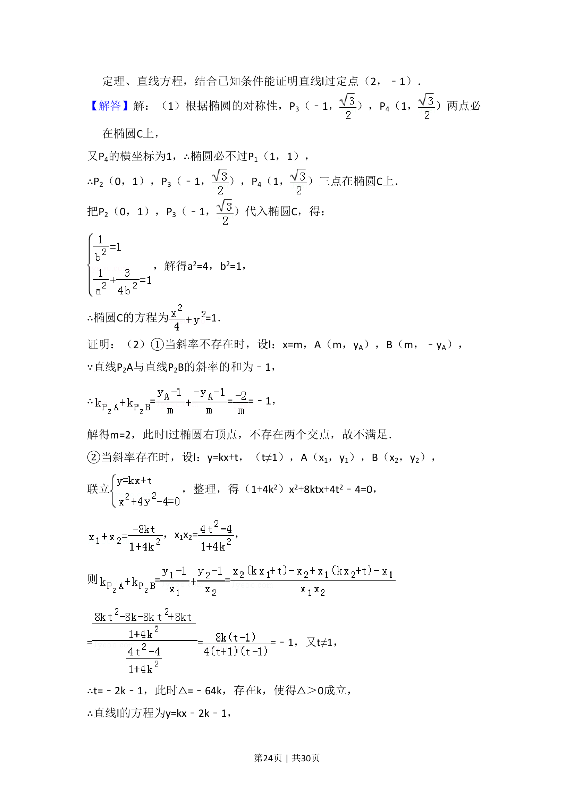
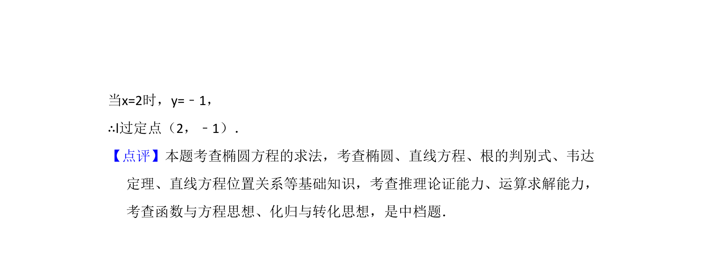

## 题面

## 摘要

根据椭圆对称性求椭圆方程，并利用斜率之和为定值证明直线过定点。

## 关联考点

- [[061-方程|椭圆的标准方程]]
- [[785-圆锥曲线的综合|圆锥曲线的综合]]
- [[015-位置|直线与椭圆的位置关系]]

## 答案与解析

> 📄 原 PDF 第 23 页：`素材/真题/湖南/2008-2024·（湖南）数学高考真题/2017年高考数学试卷（理）（新课标Ⅰ）（解析卷）.pdf`

<!-- 题干文本-start -->
## 题干文本
20．（12分）已知椭圆C：+=1（a＞b＞0），四点P 1（1，1），P2（0，1
），P3（﹣1， ），P 4（1， ）中恰有三点在椭圆C上．
（1）求C的方程；
（2）设直线l不经过P2点且与C相交于A，B两点．若直线P2A与直线P2B的斜率的
和为﹣1，证明：l过定点．
<!-- 题干文本-end -->

<!-- 解析文本-start -->
## 解析文本
【考点】K3：椭圆的标准方程；KI：圆锥曲线的综合．菁优网版权所有
【专题】14：证明题；35：转化思想；49：综合法；5E：圆锥曲线中的最值与
范围问题．
【分析】（1）根据椭圆的对称性，得到P2（0，1），P3（﹣1， ），P 4（1，
）三点在椭圆C上．把P2（0，1），P3（﹣1， ）代入椭圆C，求出a 2=4
，b2=1，由此能求出椭圆C的方程．
（2）当斜率不存在时，不满足；当斜率存在时，设l：y=kx+t，（t≠1），联立
，得（1+4k2）x2+8ktx+4t2﹣4=0，由此利用根的判别式、韦达
<!-- 解析文本-end -->
