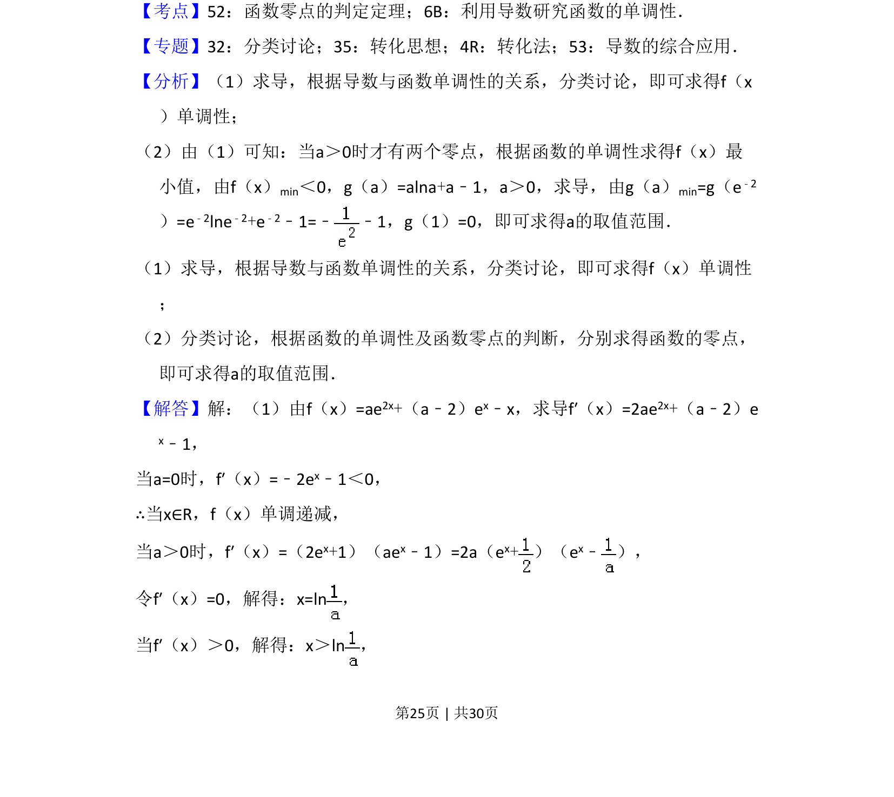
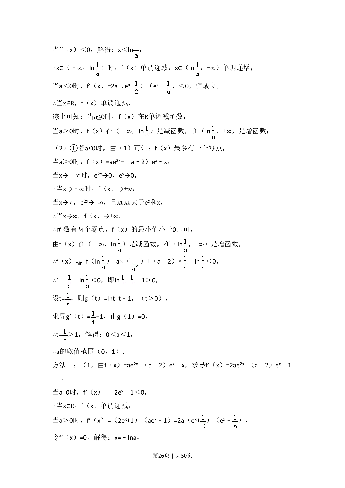
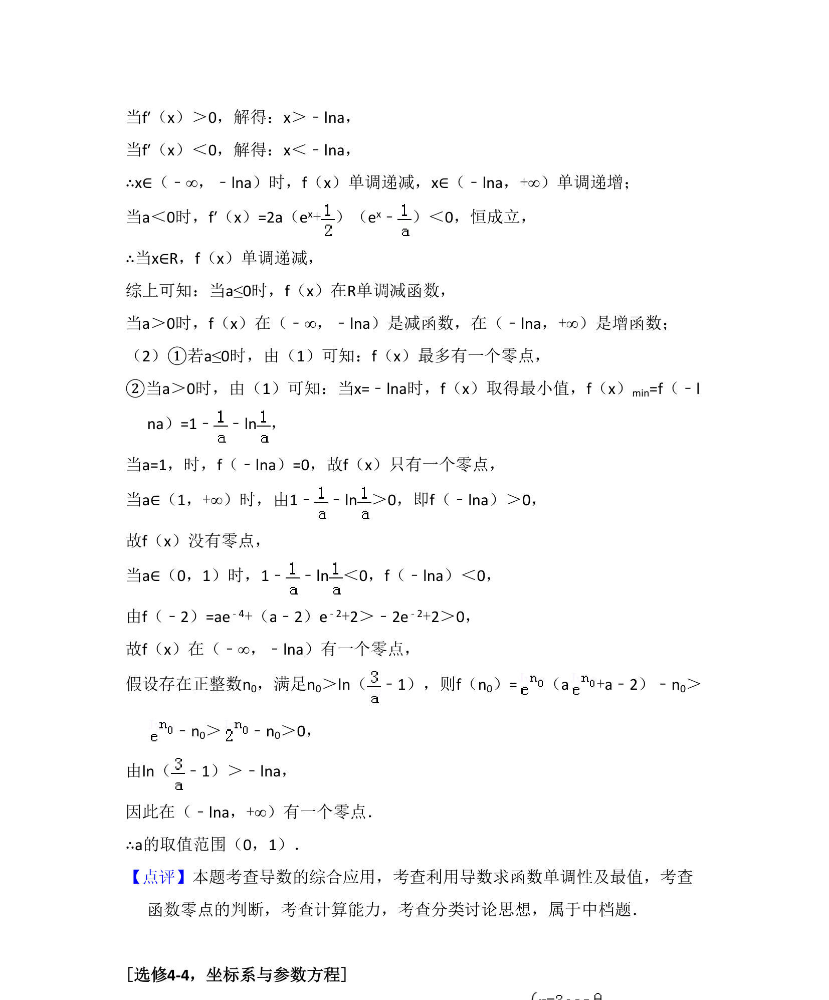

## 题面

## 摘要

利用导数讨论含参函数的单调性，并结合零点存在性求参数取值范围。

## 关联考点

- [[导数研究单调性]]
- [[函数零点判定]]
- [[424-参数分类讨论|分类讨论]]

## 答案与解析

> 📄 原 PDF 第 25 页：`素材/真题/湖南/2008-2024·（湖南）数学高考真题/2017年高考数学试卷（理）（新课标Ⅰ）（解析卷）.pdf`

<!-- 题干文本-start -->
## 题干文本
21．（12分）已知函数f（x）=ae2x+（a﹣2）ex﹣x．
（1）讨论f（x）的单调性；
（2）若f（x）有两个零点，求a的取值范围．
<!-- 题干文本-end -->

<!-- 解析文本-start -->
## 解析文本
【考点】52：函数零点的判定定理；6B：利用导数研究函数的单调性．菁优网版权所有
【专题】32：分类讨论；35：转化思想；4R：转化法；53：导数的综合应用．
【分析】（1）求导，根据导数与函数单调性的关系，分类讨论，即可求得f（x
）单调性；
（2）由（1）可知：当a＞0时才有两个零点，根据函数的单调性求得f（x）最
小值，由f（x）min＜0，g（a）=alna+a﹣1，a＞0，求导，由g（a）min=g（e﹣2
）=e﹣2lne﹣2+e﹣2﹣1=﹣ ﹣1，g（1）=0，即可求得a的取值范围．
（1）求导，根据导数与函数单调性的关系，分类讨论，即可求得f（x）单调性
；
（2）分类讨论，根据函数的单调性及函数零点的判断，分别求得函数的零点，
即可求得a的取值范围．
【解答】解：（1）由f（x）=ae2x+（a﹣2）ex﹣x，求导f′（x）=2ae2x+（a﹣2）e
x﹣1，
当a=0时，f′（x）=﹣2ex﹣1＜0，
∴当x∈R，f（x）单调递减，
当a＞0时，f′（x）=（2ex+1）（aex﹣1）=2a（ex+）（e x﹣ ），
令f′（x）=0，解得：x=ln，
当f′（x）＞0，解得：x＞ln，
<!-- 解析文本-end -->
