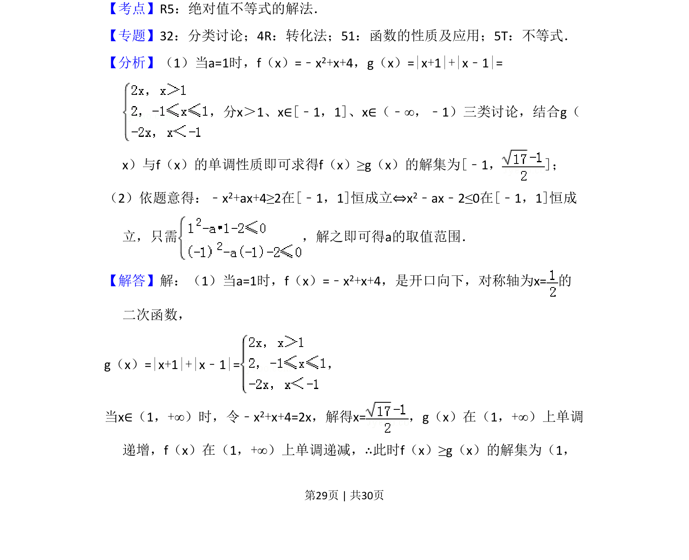
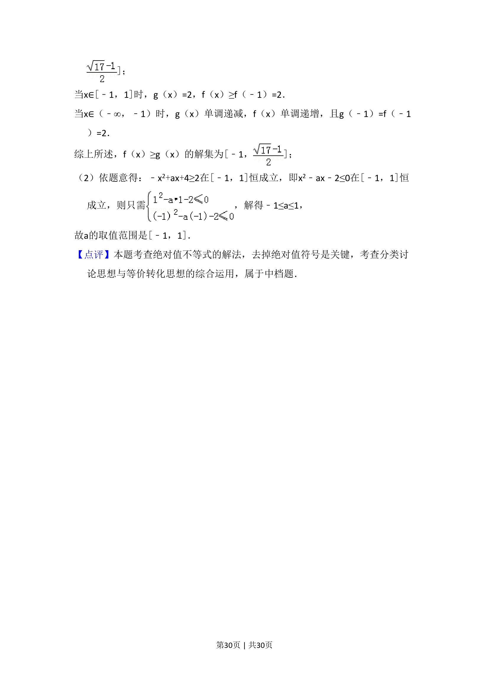

## 题面

## 摘要

本题主要考查含绝对值的不等式解法，通过分类讨论与函数性质求解参数范围。

## 关联考点

- [[1092-绝对值不等式|绝对值不等式]]
- [[212-二次函数定义|二次函数]]
- [[424-参数分类讨论|分类讨论]]
- [[450-恒成立问题|恒成立问题]]

## 答案与解析

> 📄 原 PDF 第 29 页：`素材/真题/湖南/2008-2024·（湖南）数学高考真题/2017年高考数学试卷（理）（新课标Ⅰ）（解析卷）.pdf`
