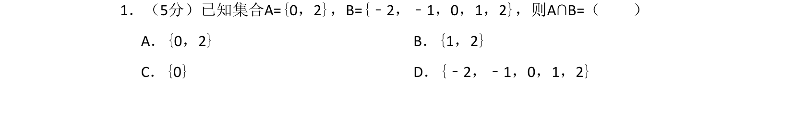
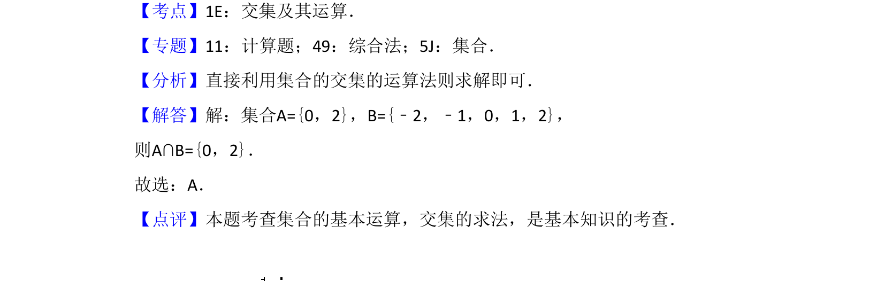

## 题面

## 摘要

考查集合交集的基本运算，属于基础题。

## 关联考点

- [[645-交集及其运算|交集及其运算]]

## 答案与解析

> 📄 原 PDF 第 1 页：`素材/真题/湖南/2008-2024·（湖南）数学高考真题/2018年高考数学试卷（文）（新课标Ⅰ）（解析卷）.pdf`

<!-- 题干文本-start -->
## 题干文本
1．（5分）已知集合A={0，2}，B={﹣2，﹣1，0，1，2}，则A∩B=（　　）
A．{0，2}B．{1，2}
C．{0}D．{﹣2，﹣1，0，1，2}
<!-- 题干文本-end -->

<!-- 解析文本-start -->
## 解析文本
【考点】1E：交集及其运算．菁优网版权所有
【专题】11：计算题；49：综合法；5J：集合．
【分析】直接利用集合的交集的运算法则求解即可．
【解答】解：集合A={0，2}，B={﹣2，﹣1，0，1，2}，
则A∩B={0，2}．
故选：A．
【点评】本题考查集合的基本运算，交集的求法，是基本知识的考查．
<!-- 解析文本-end -->
