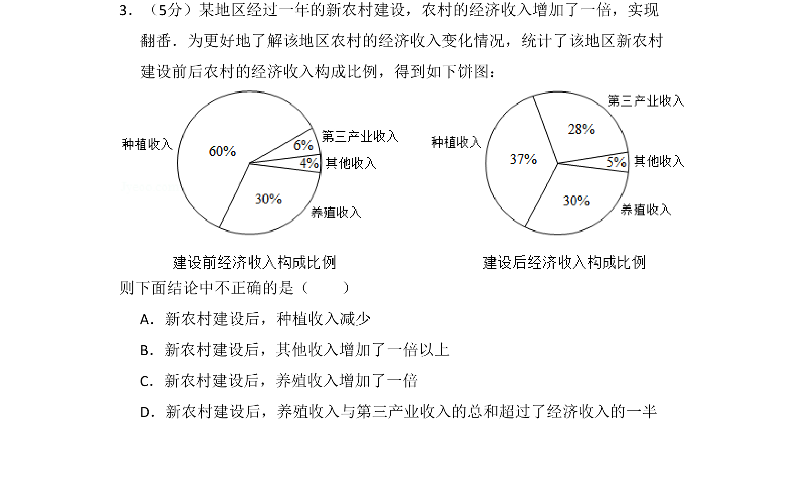
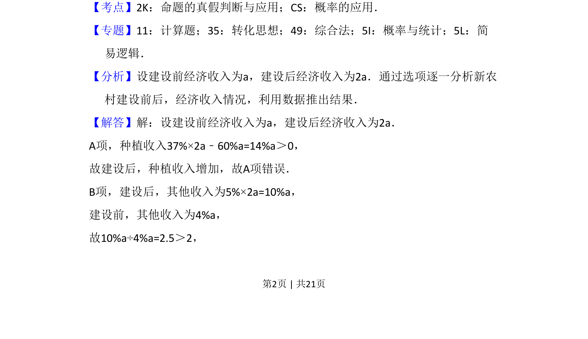
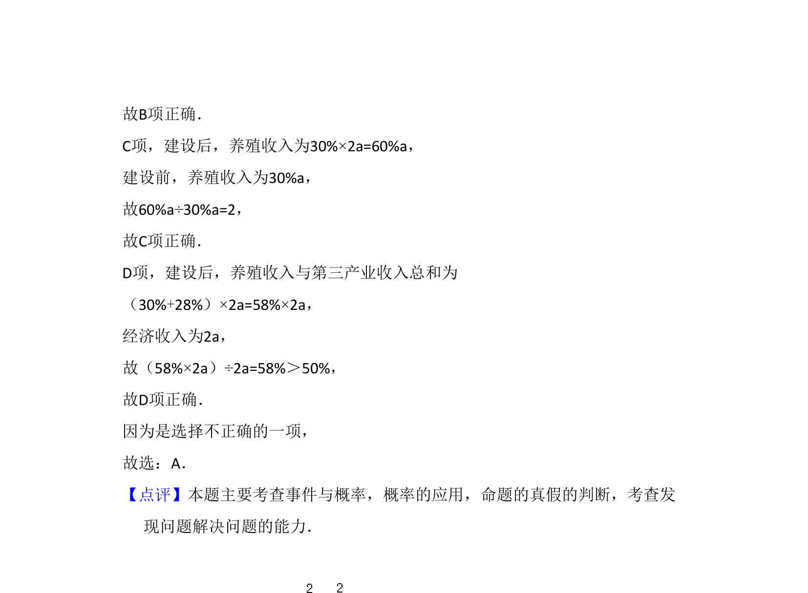

## 题面

## 摘要

该题通过新农村建设前后经济收入构成比例的饼图，考查数据分析和命题真假的判断。

## 关联考点

- [[饼图数据分析]]
- [[765-命题真假判断|命题真假判断]]
- [[341-概率应用|概率应用]]

## 答案与解析

> 📄 原 PDF 第 2 页：`素材/真题/湖南/2008-2024·（湖南）数学高考真题/2018年高考数学试卷（文）（新课标Ⅰ）（解析卷）.pdf`
