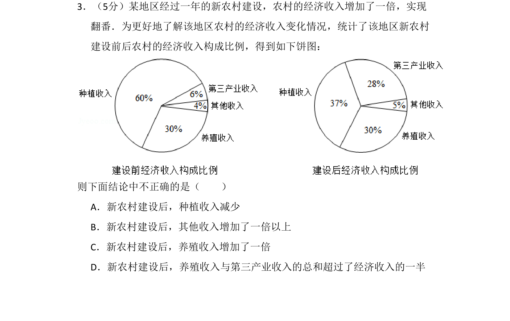
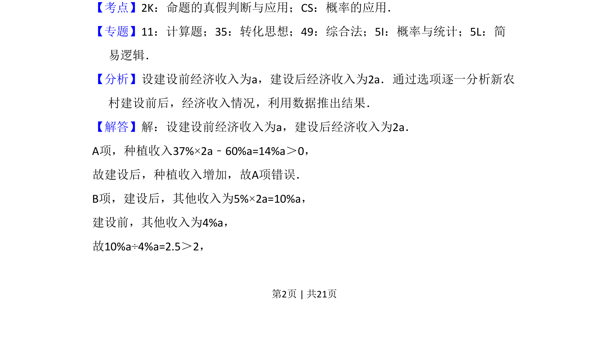
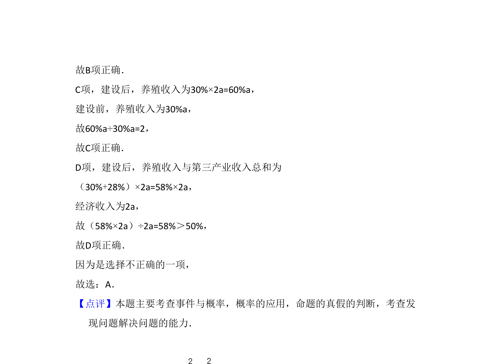

## 题面

## 摘要

该题通过新农村建设前后经济收入构成比例的饼图，考查数据分析和命题真假的判断。

## 关联考点

- [[饼图数据分析]]
- [[765-命题真假判断|命题真假判断]]
- [[341-概率应用|概率应用]]

## 答案与解析

> 📄 原 PDF 第 2 页：`素材/真题/湖南/2008-2024·（湖南）数学高考真题/2018年高考数学试卷（文）（新课标Ⅰ）（解析卷）.pdf`

<!-- 题干文本-start -->
## 题干文本
3．（5分）某地区经过一年的新农村建设，农村的经济收入增加了一倍，实现
翻番．为更好地了解该地区农村的经济收入变化情况，统计了该地区新农村
建设前后农村的经济收入构成比例，得到如下饼图：
则下面结论中不正确的是（　　）
A．新农村建设后，种植收入减少
B．新农村建设后，其他收入增加了一倍以上
C．新农村建设后，养殖收入增加了一倍
D．新农村建设后，养殖收入与第三产业收入的总和超过了经济收入的一半
<!-- 题干文本-end -->

<!-- 解析文本-start -->
## 解析文本
【考点】2K：命题的真假判断与应用；CS：概率的应用．菁优网版权所有
【专题】11：计算题；35：转化思想；49：综合法；5I：概率与统计；5L：简
易逻辑．
【分析】设建设前经济收入为a，建设后经济收入为2a．通过选项逐一分析新农
村建设前后，经济收入情况，利用数据推出结果．
【解答】解：设建设前经济收入为a，建设后经济收入为2a．
A项，种植收入37%×2a﹣60%a=14%a＞0，
故建设后，种植收入增加，故A项错误．
B项，建设后，其他收入为5%×2a=10%a，
建设前，其他收入为4%a，
故10%a÷4%a=2.5＞2，
<!-- 解析文本-end -->
