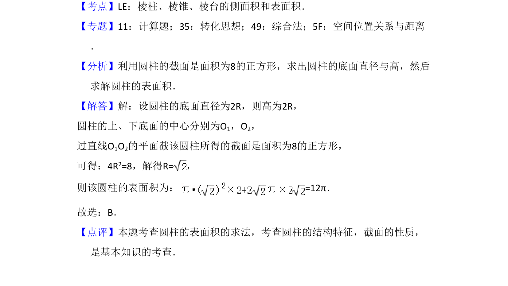

## 题面

## 摘要

该题通过圆柱轴截面为正方形求表面积，考查圆柱结构特征与表面积计算。

## 关联考点

- [[圆柱的结构特征]]
- [[轴截面]]
- [[圆柱的表面积]]

## 答案与解析

> 📄 原 PDF 第 4 页：`素材/真题/湖南/2008-2024·（湖南）数学高考真题/2018年高考数学试卷（文）（新课标Ⅰ）（解析卷）.pdf`

<!-- 题干文本-start -->
## 题干文本
5．（5分）已知圆柱的上、下底面的中心分别为O1，O2，过直线O1O2的平面截
该圆柱所得的截面是面积为8的正方形，则该圆柱的表面积为（　　）
A．12πB．12πC．8πD．10π
<!-- 题干文本-end -->

<!-- 解析文本-start -->
## 解析文本
【考点】LE：棱柱、棱锥、棱台的侧面积和表面积．菁优网版权所有
【专题】11：计算题；35：转化思想；49：综合法；5F：空间位置关系与距离
．
【分析】利用圆柱的截面是面积为8的正方形，求出圆柱的底面直径与高，然后
求解圆柱的表面积．
【解答】解：设圆柱的底面直径为2R，则高为2R，
圆柱的上、下底面的中心分别为O1，O2，
过直线O1O2的平面截该圆柱所得的截面是面积为8的正方形，
可得：4R2=8，解得R=，
则该圆柱的表面积为：=12π．
故选：B．
【点评】本题考查圆柱的表面积的求法，考查圆柱的结构特征，截面的性质，
是基本知识的考查．
<!-- 解析文本-end -->
