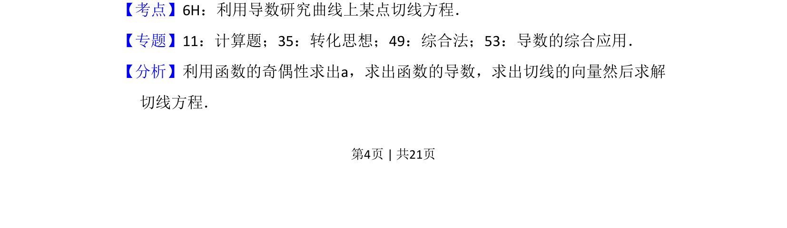
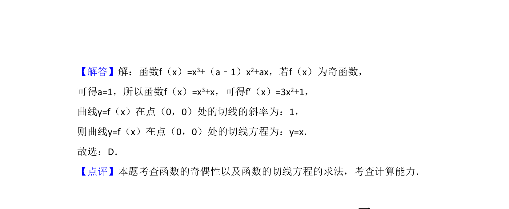

## 题面

## 摘要

函数奇偶性求参数，结合导数几何意义求切线方程

## 关联考点

- [[284-函数的奇偶性|函数的奇偶性]]
- [[440-导数的几何意义|导数的几何意义]]
- [[422-切线方程|切线方程]]

## 答案与解析

> 📄 原 PDF 第 4 页：`素材/真题/湖南/2008-2024·（湖南）数学高考真题/2018年高考数学试卷（文）（新课标Ⅰ）（解析卷）.pdf`

<!-- 题干文本-start -->
## 题干文本
6．（5分）设函数f（x）=x3+（a﹣1）x2+ax．若f（x）为奇函数，则曲线y=f（x
）在点（0，0）处的切线方程为（　　）
A．y=﹣2x B．y=﹣x C．y=2x D．y=x
<!-- 题干文本-end -->

<!-- 解析文本-start -->
## 解析文本
【考点】6H：利用导数研究曲线上某点切线方程．菁优网版权所有
【专题】11：计算题；35：转化思想；49：综合法；53：导数的综合应用．
【分析】利用函数的奇偶性求出a，求出函数的导数，求出切线的向量然后求解
切线方程．
<!-- 解析文本-end -->
