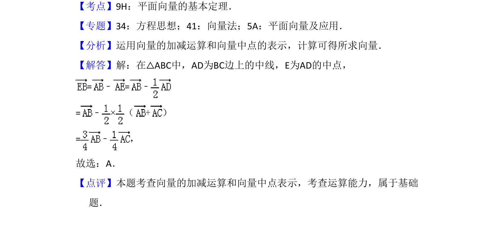

## 题面

## 摘要

在三角形中，利用向量的加减法和中点表示，求目标向量。

## 关联考点

- [[1410-平面向量的基本定理|平面向量的基本定理]]
- [[1408-向量的加减运算|向量的加减运算]]
- [[中线与中点的向量表示]]

## 答案与解析

> 📄 原 PDF 第 5 页：`素材/真题/湖南/2008-2024·（湖南）数学高考真题/2018年高考数学试卷（文）（新课标Ⅰ）（解析卷）.pdf`
