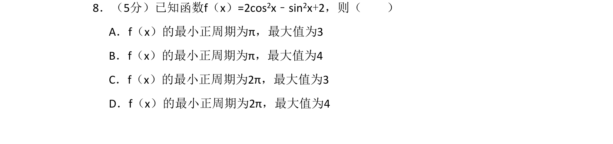
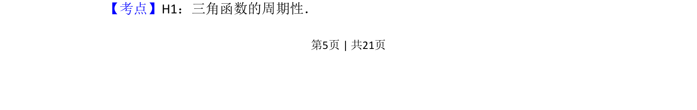
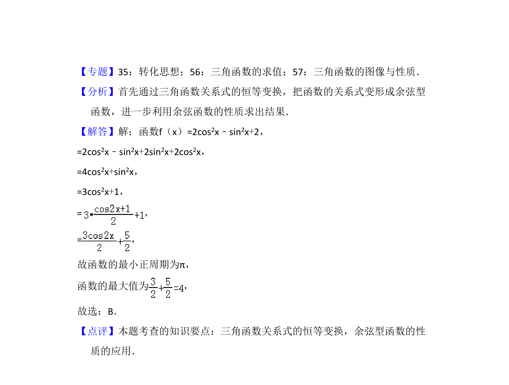

## 题面

## 摘要

三角函数化简后求最小正周期和最值

## 关联考点

- [[272-三角恒等变换|三角恒等变换]]
- [[611-三角函数的周期性|三角函数的周期性]]
- [[615-三角函数的最值|三角函数的最值]]

## 答案与解析

> 📄 原 PDF 第 5 页：`素材/真题/湖南/2008-2024·（湖南）数学高考真题/2018年高考数学试卷（文）（新课标Ⅰ）（解析卷）.pdf`
