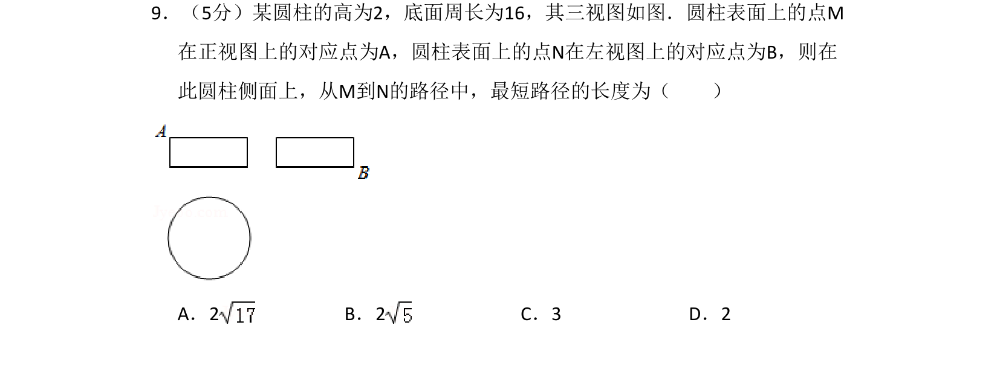
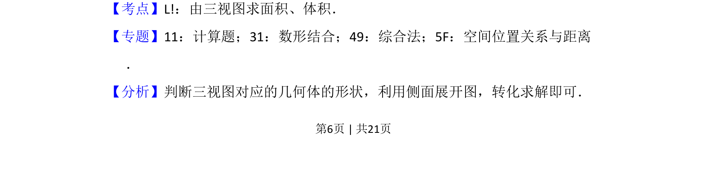
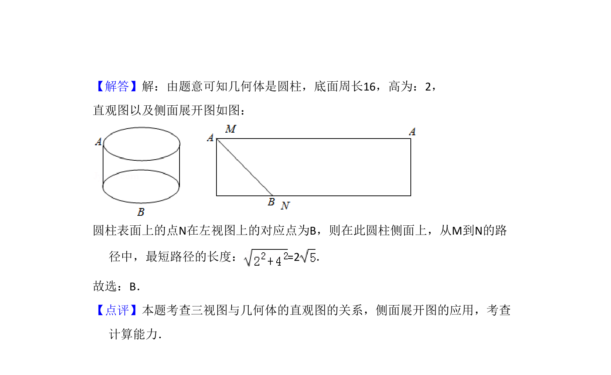

## 题面

## 摘要

该题考查由三视图还原圆柱，并利用侧面展开图求表面上两点间的最短路径长度。

## 关联考点

- [[1056-立体图形还原|三视图还原几何体]]
- [[圆柱侧面展开图]]
- [[1411-最短路径|最短路径]]

## 答案与解析

> 📄 原 PDF 第 6 页：`素材/真题/湖南/2008-2024·（湖南）数学高考真题/2018年高考数学试卷（文）（新课标Ⅰ）（解析卷）.pdf`
