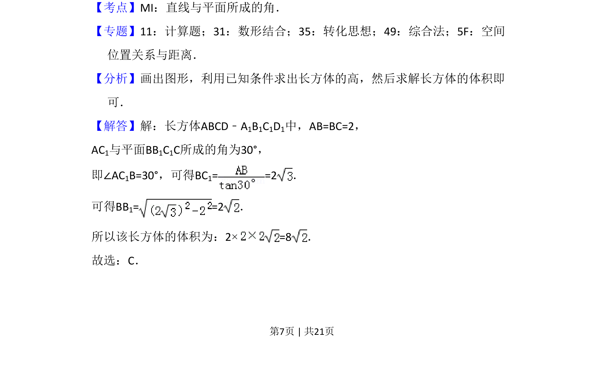
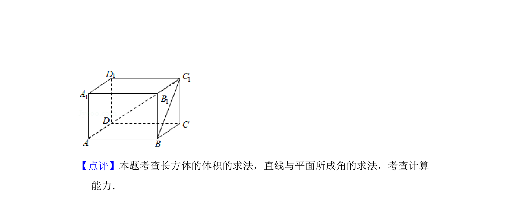

## 题面

## 摘要

长方体中线面角的计算与体积求解，通过已知角度求高并计算体积。

## 关联考点

- [[1013-直线与平面所成的角|直线与平面所成的角]]
- [[空间几何体的体积]]
- [[897-数形结合|数形结合]]

## 答案与解析

> 📄 原 PDF 第 7 页：`素材/真题/湖南/2008-2024·（湖南）数学高考真题/2018年高考数学试卷（文）（新课标Ⅰ）（解析卷）.pdf`
