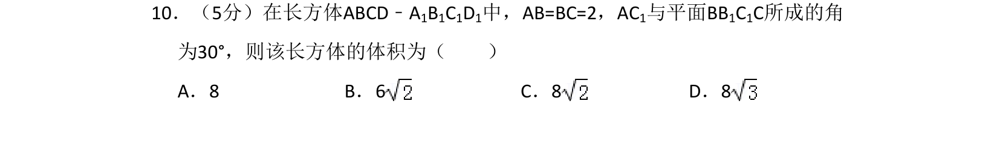
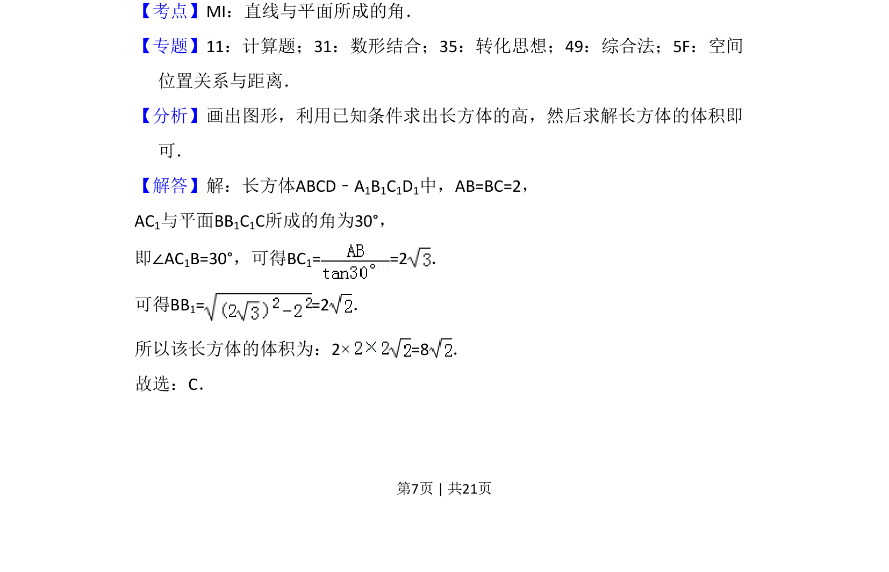
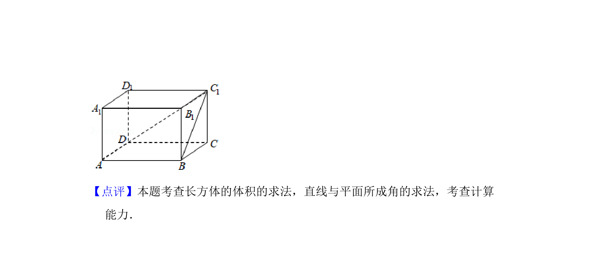

## 题面

## 摘要

长方体中线面角的计算与体积求解，通过已知角度求高并计算体积。

## 关联考点

- [[1013-直线与平面所成的角|直线与平面所成的角]]
- [[空间几何体的体积]]
- [[897-数形结合|数形结合]]

## 答案与解析

> 📄 原 PDF 第 7 页：`素材/真题/湖南/2008-2024·（湖南）数学高考真题/2018年高考数学试卷（文）（新课标Ⅰ）（解析卷）.pdf`

<!-- 题干文本-start -->
## 题干文本
10．（5分）在长方体ABCD﹣A1B1C1D1中，AB=BC=2，AC1与平面BB1C1C所成的角
为30°，则该长方体的体积为（　　）
A．8 B．6 C．8 D．8
<!-- 题干文本-end -->

<!-- 解析文本-start -->
## 解析文本
【考点】MI：直线与平面所成的角．菁优网版权所有
【专题】11：计算题；31：数形结合；35：转化思想；49：综合法；5F：空间
位置关系与距离．
【分析】画出图形，利用已知条件求出长方体的高，然后求解长方体的体积即
可．
【解答】解：长方体ABCD﹣A1B1C1D1中，AB=BC=2，
AC1与平面BB1C1C所成的角为30°，
即∠AC1B=30°，可得BC1= =2．
可得BB1= =2．
所以该长方体的体积为：2×=8．
故选：C．
<!-- 解析文本-end -->
