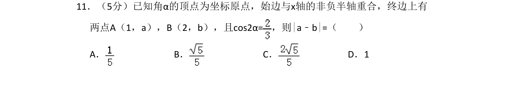
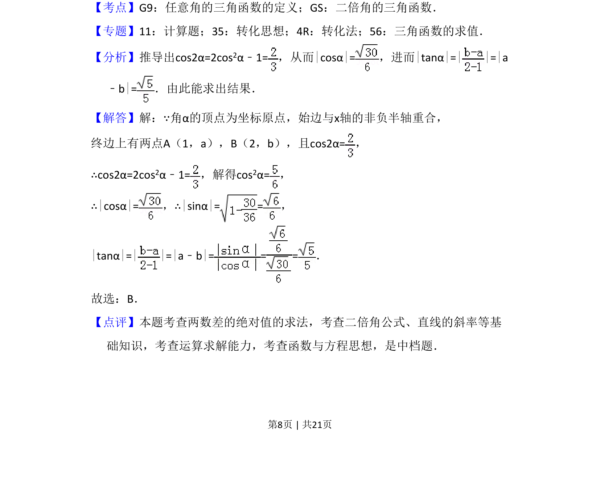

## 题面

## 摘要

已知角α终边上两点坐标及cos2α的值，求这两点纵坐标差的绝对值。

## 关联考点

- [[任意角的三角函数的定义]]
- [[638-二倍角的三角函数|二倍角的三角函数]]

## 答案与解析

> 📄 原 PDF 第 8 页：`素材/真题/湖南/2008-2024·（湖南）数学高考真题/2018年高考数学试卷（文）（新课标Ⅰ）（解析卷）.pdf`

<!-- 题干文本-start -->
## 题干文本
11．（5分）已知角α的顶点为坐标原点，始边与x轴的非负半轴重合，终边上有
两点A（1，a），B（2，b），且cos2α=，则|a﹣b|=（　　）
A．B．C．D．1
<!-- 题干文本-end -->

<!-- 解析文本-start -->
## 解析文本
【考点】G9：任意角的三角函数的定义；GS：二倍角的三角函数．菁优网版权所有
【专题】11：计算题；35：转化思想；4R：转化法；56：三角函数的求值．
【分析】推导出cos2α=2cos2α﹣1=，从而|cosα|=，进而|tanα|=| |=|a
﹣b|=．由此能求出结果．
【解答】解：∵角α的顶点为坐标原点，始边与x轴的非负半轴重合，
终边上有两点A（1，a），B（2，b），且cos2α=，
∴cos2α=2cos2α﹣1=，解得cos 2α=，
∴|cosα|=，∴|sinα|= =，
|tanα|=| |=|a﹣b|= = =．
故选：B．
【点评】本题考查两数差的绝对值的求法，考查二倍角公式、直线的斜率等基
础知识，考查运算求解能力，考查函数与方程思想，是中档题．
<!-- 解析文本-end -->
