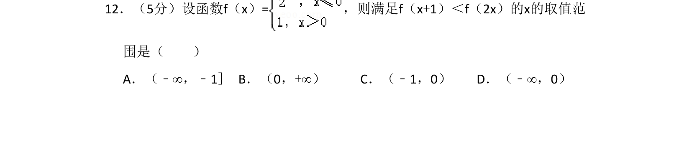
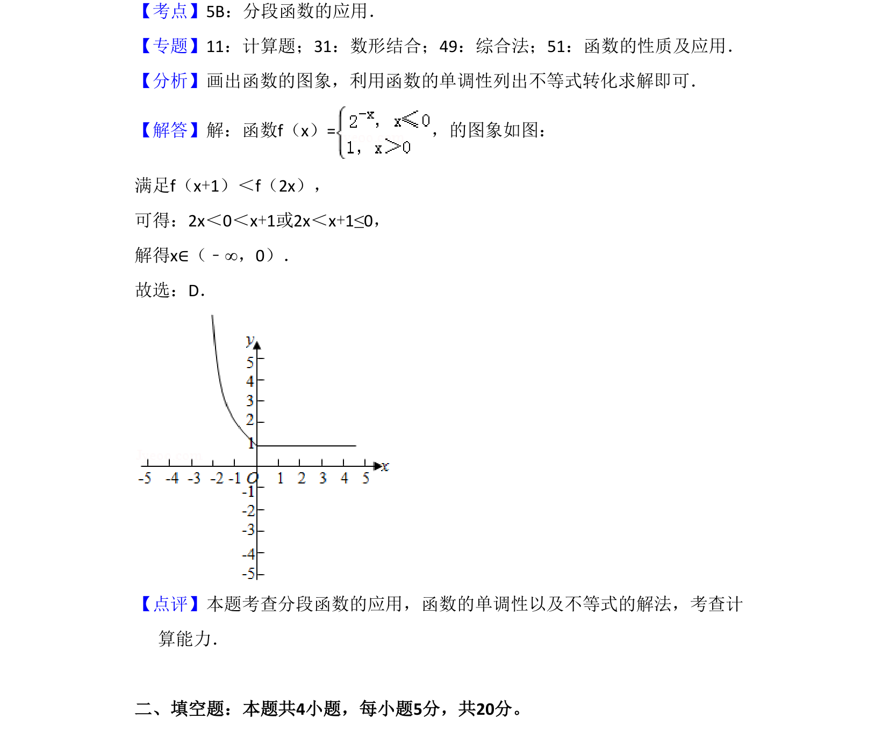

## 题面

## 摘要

考查分段函数图象与单调性，通过图象解不等式求参数取值范围。

## 关联考点

- [[290-分段函数|分段函数]]
- [[432-导数与函数单调性|函数单调性]]
- [[不等式解法]]
- [[897-数形结合|数形结合]]

## 答案与解析

> 📄 原 PDF 第 9 页：`素材/真题/湖南/2008-2024·（湖南）数学高考真题/2018年高考数学试卷（文）（新课标Ⅰ）（解析卷）.pdf`
