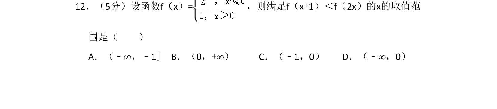
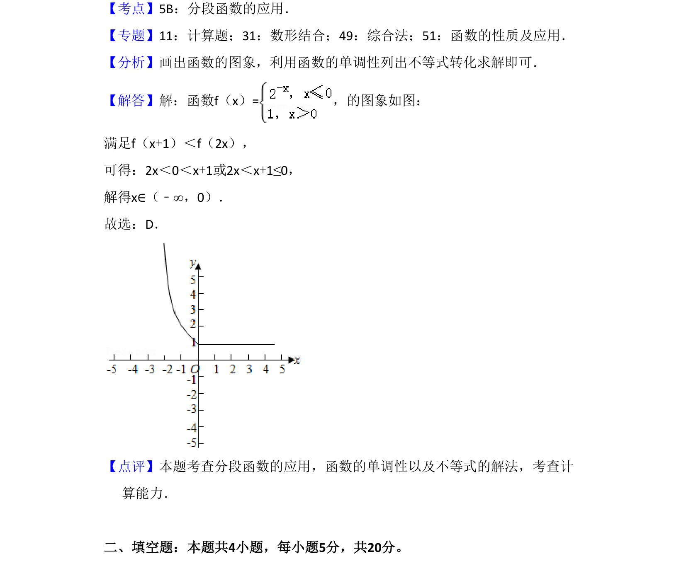

## 题面

## 摘要

考查分段函数图象与单调性，通过图象解不等式求参数取值范围。

## 关联考点

- [[290-分段函数|分段函数]]
- [[432-导数与函数单调性|函数单调性]]
- [[不等式解法]]
- [[897-数形结合|数形结合]]

## 答案与解析

> 📄 原 PDF 第 9 页：`素材/真题/湖南/2008-2024·（湖南）数学高考真题/2018年高考数学试卷（文）（新课标Ⅰ）（解析卷）.pdf`

<!-- 题干文本-start -->
## 题干文本
12．（5分）设函数f（x）=，则满足f（x+1）＜f（2x）的x的取值范
围是（　　）
A．（﹣∞，﹣1]B．（0，+∞）C．（﹣1，0）D．（﹣∞，0）
<!-- 题干文本-end -->

<!-- 解析文本-start -->
## 解析文本
【考点】5B：分段函数的应用．菁优网版权所有
【专题】11：计算题；31：数形结合；49：综合法；51：函数的性质及应用．
【分析】画出函数的图象，利用函数的单调性列出不等式转化求解即可．
【解答】解：函数f（x）=，的图象如图：
满足f（x+1）＜f（2x），
可得：2x＜0＜x+1或2x＜x+1≤0，
解得x∈（﹣∞，0）．
故选：D．
【点评】本题考查分段函数的应用，函数的单调性以及不等式的解法，考查计
算能力．
　
二、填空题：本题共4小题，每小题5分，共20分。
<!-- 解析文本-end -->
