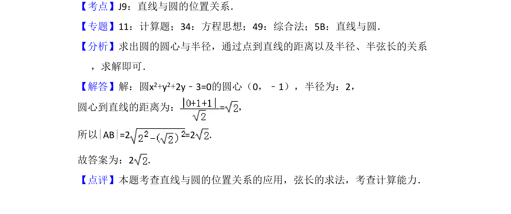

## 题面

## 摘要

直线与圆相交时的弦长计算，通过圆心到直线的距离和半径求解。

## 关联考点

- [[394-直线和圆位置关系-高中|直线与圆的位置关系]]
- [[867-弦长公式|弦长公式]]
- [[980-点到直线的距离|点到直线的距离]]

## 答案与解析

> 📄 原 PDF 第 11 页：`素材/真题/湖南/2008-2024·（湖南）数学高考真题/2018年高考数学试卷（文）（新课标Ⅰ）（解析卷）.pdf`
