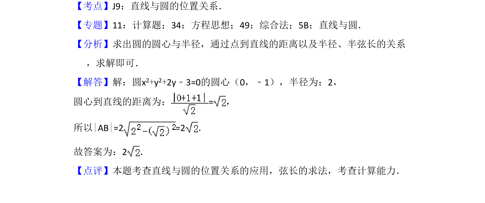

## 题面

## 摘要

直线与圆相交时的弦长计算，通过圆心到直线的距离和半径求解。

## 关联考点

- [[394-直线和圆位置关系-高中|直线与圆的位置关系]]
- [[867-弦长公式|弦长公式]]
- [[1211-点到直线距离|点到直线的距离]]

## 答案与解析

> 📄 原 PDF 第 11 页：`素材/真题/湖南/2008-2024·（湖南）数学高考真题/2018年高考数学试卷（文）（新课标Ⅰ）（解析卷）.pdf`

<!-- 题干文本-start -->
## 题干文本
15．（5分）直线y=x+1与圆x2+y2+2y﹣3=0交于A，B两点，则|AB|=　2 　．
<!-- 题干文本-end -->

<!-- 解析文本-start -->
## 解析文本
【考点】J9：直线与圆的位置关系．菁优网版权所有
【专题】11：计算题；34：方程思想；49：综合法；5B：直线与圆．
【分析】求出圆的圆心与半径，通过点到直线的距离以及半径、半弦长的关系
，求解即可．
【解答】解：圆x2+y2+2y﹣3=0的圆心（0，﹣1），半径为：2，
圆心到直线的距离为：=，
所以|AB|=2 =2．
故答案为：2．
【点评】本题考查直线与圆的位置关系的应用，弦长的求法，考查计算能力．
<!-- 解析文本-end -->
