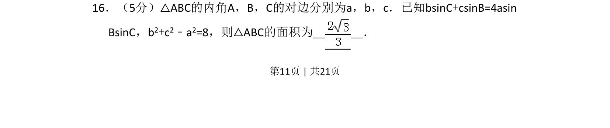
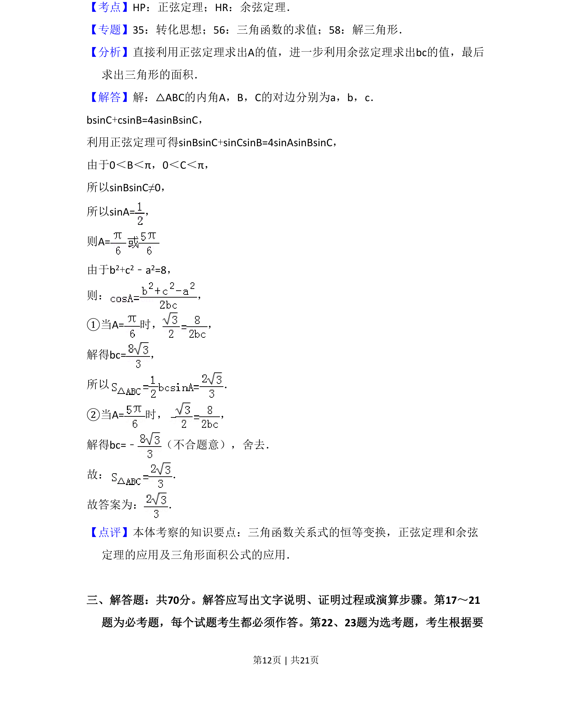

## 题面

## 摘要

该题考查利用正弦定理和余弦定理化简三角恒等式，并结合三角形面积公式求解面积。

## 关联考点

- [[126-定理|正弦定理]]
- [[126-定理|余弦定理]]
- [[062-多边形面积|三角形面积]]

## 答案与解析

> 📄 原 PDF 第 11 页：`素材/真题/湖南/2008-2024·（湖南）数学高考真题/2018年高考数学试卷（文）（新课标Ⅰ）（解析卷）.pdf`
