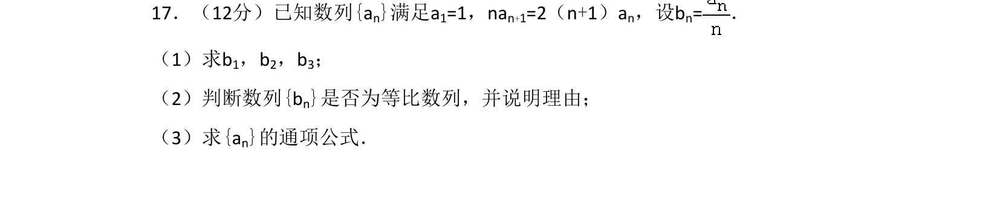
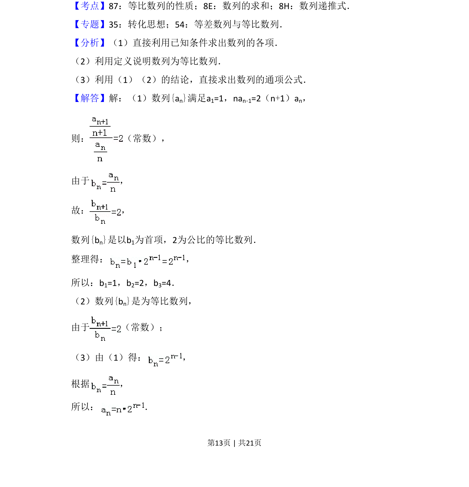

## 题面

## 摘要

数列递推关系转化为等比数列判定并求特定项与通项

## 关联考点

- [[413-等比数列性质|等比数列的性质]]
- [[893-数列的求和|数列的求和]]
- [[894-数列递推式|数列递推式]]

## 答案与解析

> 📄 原 PDF 第 13 页：`素材/真题/湖南/2008-2024·（湖南）数学高考真题/2018年高考数学试卷（文）（新课标Ⅰ）（解析卷）.pdf`

<!-- 题干文本-start -->
## 题干文本
17．（12分）已知数列{an}满足a1=1，nan+1=2（n+1）an，设bn=．
（1）求b1，b2，b3；
（2）判断数列{bn}是否为等比数列，并说明理由；
（3）求{an}的通项公式．
<!-- 题干文本-end -->

<!-- 解析文本-start -->
## 解析文本
【考点】87：等比数列的性质；8E：数列的求和；8H：数列递推式．菁优网版权所有
【专题】35：转化思想；54：等差数列与等比数列．
【分析】（1）直接利用已知条件求出数列的各项．
（2）利用定义说明数列为等比数列．
（3）利用（1）（2）的结论，直接求出数列的通项公式．
【解答】解：（1）数列{an}满足a1=1，nan+1=2（n+1）an，
则： （常数），
由于 ，
故： ，
数列{bn}是以b1为首项，2为公比的等比数列．
整理得： ，
所以：b1=1，b2=2，b3=4．
（2）数列{bn}是为等比数列，
由于 （常数）；
（3）由（1）得： ，
根据 ，
所以： ．
<!-- 解析文本-end -->
