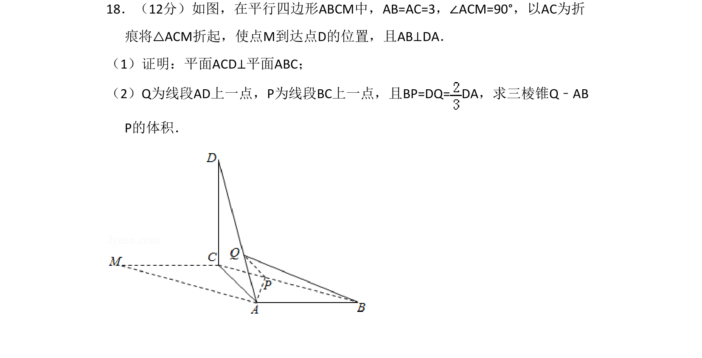
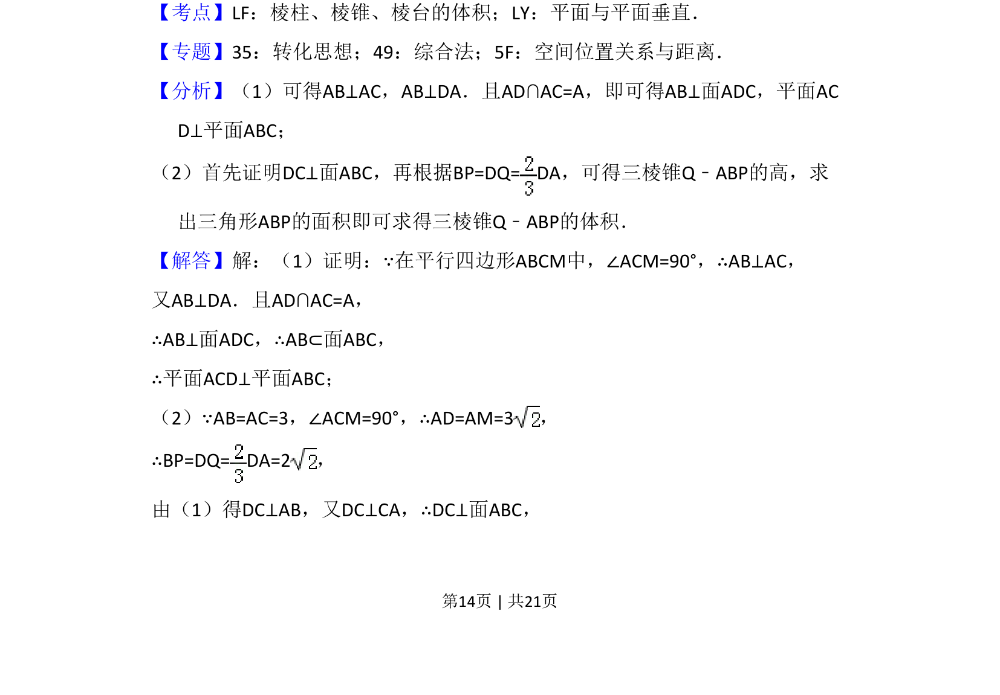
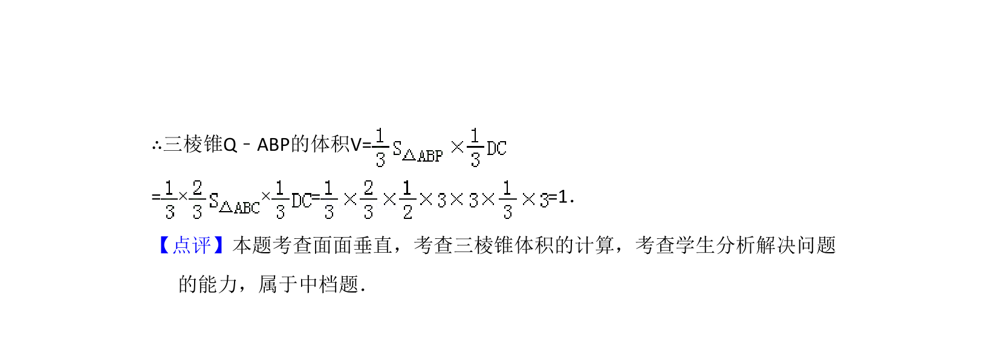

## 题面

## 摘要

证明面面垂直与求三棱锥体积，涉及线面垂直判定与体积转换

## 关联考点

- [[1397-平面与平面垂直|平面与平面垂直]]
- [[936-棱锥体积|棱锥体积]]
- [[1086-线面垂直的判定与性质|线面垂直]]

## 答案与解析

> 📄 原 PDF 第 14 页：`素材/真题/湖南/2008-2024·（湖南）数学高考真题/2018年高考数学试卷（文）（新课标Ⅰ）（解析卷）.pdf`
