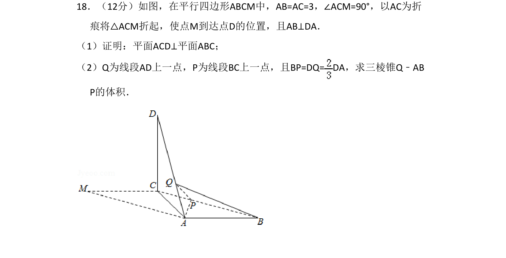
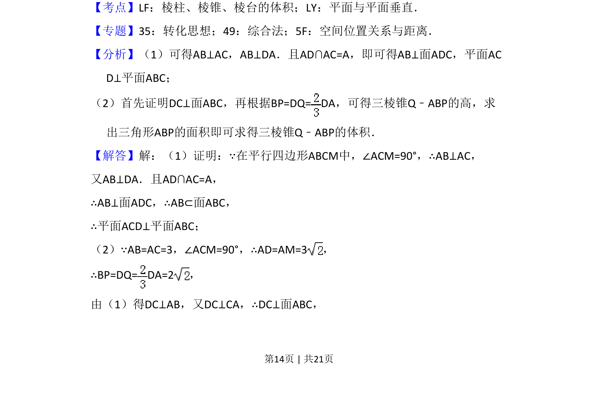
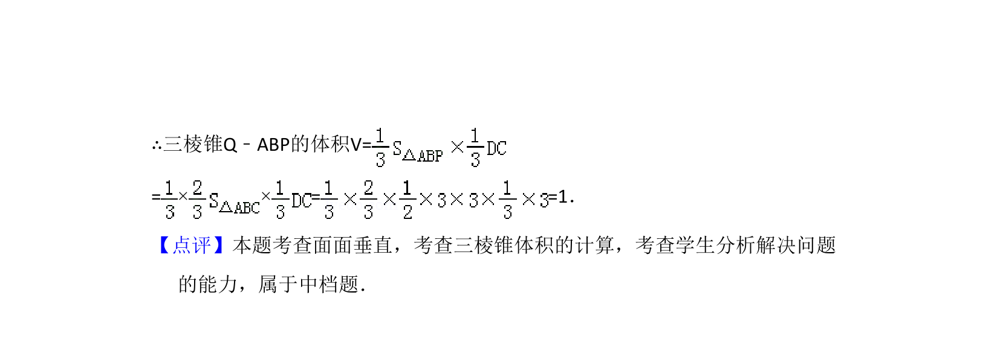

## 题面

## 摘要

证明面面垂直与求三棱锥体积，涉及线面垂直判定与体积转换

## 关联考点

- [[1397-平面与平面垂直|平面与平面垂直]]
- [[936-棱锥体积|棱锥体积]]
- [[1086-线面垂直的判定与性质|线面垂直]]

## 答案与解析

> 📄 原 PDF 第 14 页：`素材/真题/湖南/2008-2024·（湖南）数学高考真题/2018年高考数学试卷（文）（新课标Ⅰ）（解析卷）.pdf`

<!-- 题干文本-start -->
## 题干文本
18．（12分）如图，在平行四边形ABCM中，AB=AC=3，∠ACM=90°，以AC为折
痕将△ACM折起，使点M到达点D的位置，且AB⊥DA．
（1）证明：平面ACD⊥平面ABC；
（2）Q为线段AD上一点，P为线段BC上一点，且BP=DQ= DA，求三棱锥Q﹣AB
P的体积．
<!-- 题干文本-end -->

<!-- 解析文本-start -->
## 解析文本
【考点】LF：棱柱、棱锥、棱台的体积；LY：平面与平面垂直．菁优网版权所有
【专题】35：转化思想；49：综合法；5F：空间位置关系与距离．
【分析】（1）可得AB⊥AC，AB⊥DA．且AD∩AC=A，即可得AB⊥面ADC，平面AC
D⊥平面ABC；
（2）首先证明DC⊥面ABC，再根据BP=DQ= DA，可得三棱锥Q﹣ABP的高，求
出三角形ABP的面积即可求得三棱锥Q﹣ABP的体积．
【解答】解：（1）证明：∵在平行四边形ABCM中，∠ACM=90°，∴AB⊥AC，
又AB⊥DA．且AD∩AC=A，
∴AB⊥面ADC，∴AB⊂面ABC，
∴平面ACD⊥平面ABC；
（2）∵AB=AC=3，∠ACM=90°，∴AD=AM=3，
∴BP=DQ= DA=2，
由（1）得DC⊥AB，又DC⊥CA，∴DC⊥面ABC，
<!-- 解析文本-end -->
