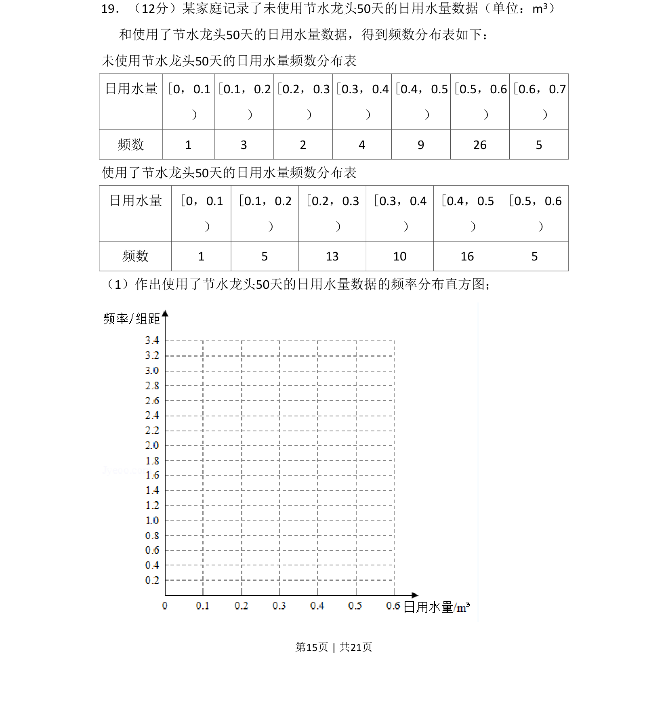
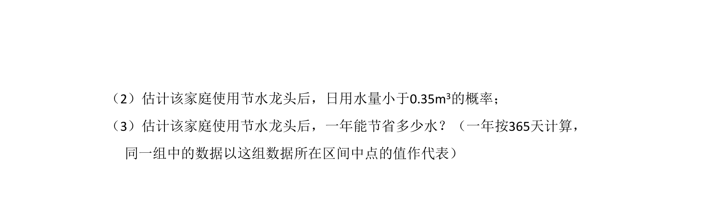
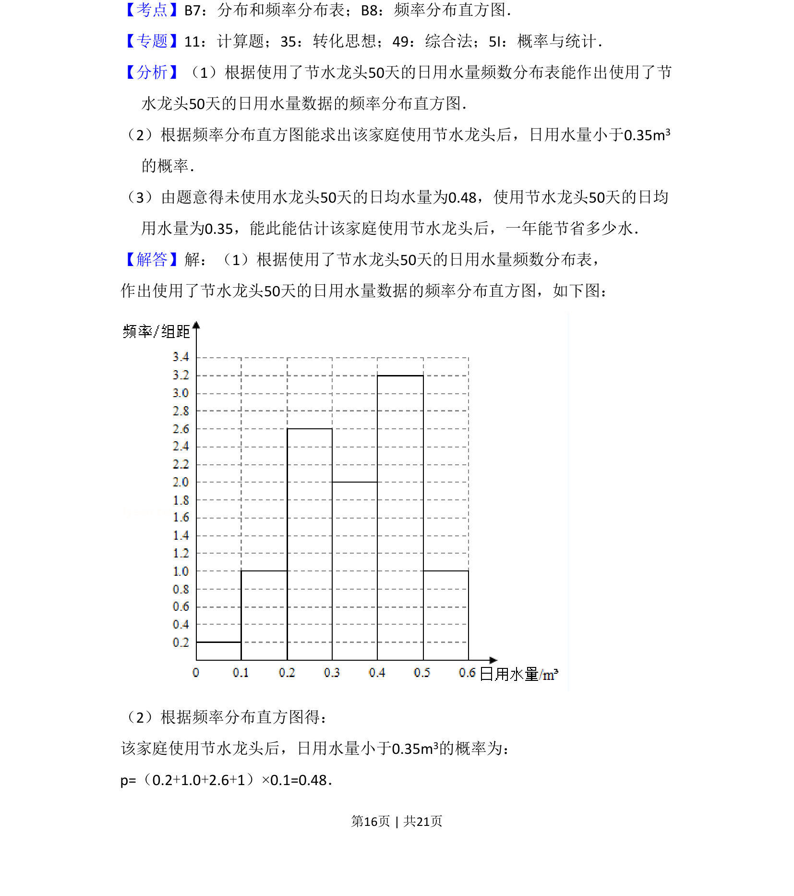
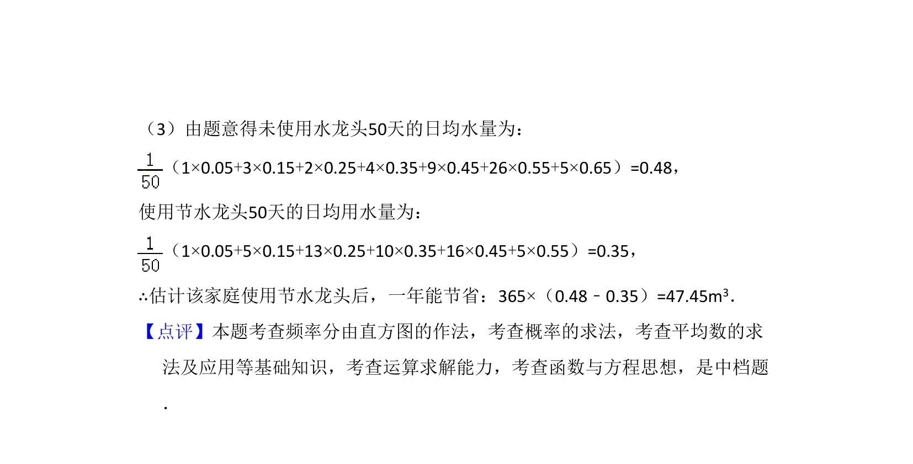

## 题面

## 摘要

本题要求根据使用了节水龙头后的日用水量频数分布表绘制频率分布直方图。

## 关联考点

- [[364-频率分布直方图|频率分布直方图]]
- [[1152-频数分布表|频数分布表]]
- [[141-统计图|数据可视化]]

## 答案与解析

> 📄 原 PDF 第 15 页：`素材/真题/湖南/2008-2024·（湖南）数学高考真题/2018年高考数学试卷（文）（新课标Ⅰ）（解析卷）.pdf`
