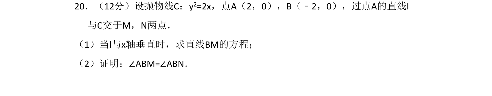
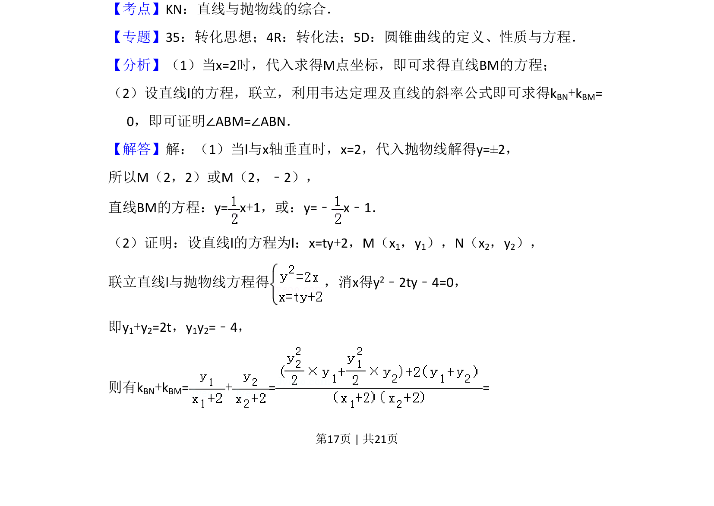
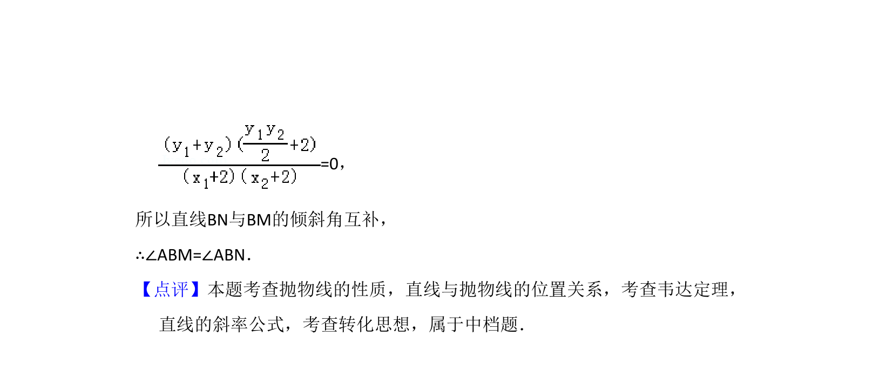

## 题面

## 摘要

直线与抛物线综合，求直线方程并证明两角相等。

## 关联考点

- [[1018-直线与抛物线的综合|直线与抛物线的综合]]
- [[234-韦达定理-初中|韦达定理]]
- [[902-斜率公式|斜率公式]]

## 答案与解析

> 📄 原 PDF 第 17 页：`素材/真题/湖南/2008-2024·（湖南）数学高考真题/2018年高考数学试卷（文）（新课标Ⅰ）（解析卷）.pdf`
