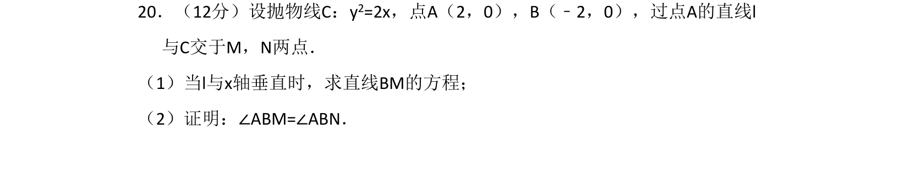
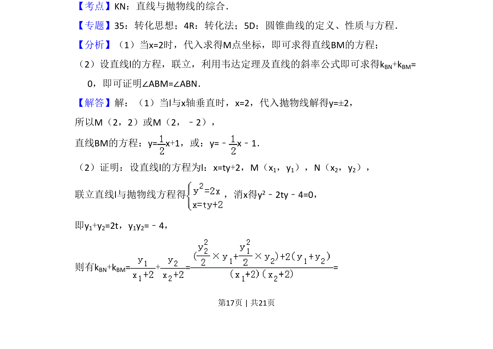
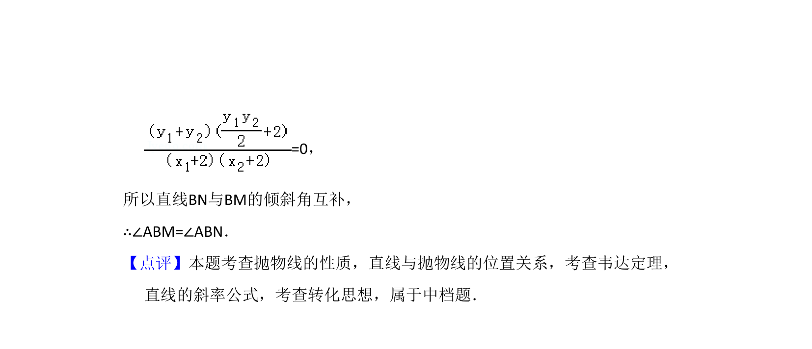

## 题面

## 摘要

直线与抛物线综合，求直线方程并证明两角相等。

## 关联考点

- [[1018-直线与抛物线的综合|直线与抛物线的综合]]
- [[234-韦达定理-初中|韦达定理]]
- [[902-斜率公式|斜率公式]]

## 答案与解析

> 📄 原 PDF 第 17 页：`素材/真题/湖南/2008-2024·（湖南）数学高考真题/2018年高考数学试卷（文）（新课标Ⅰ）（解析卷）.pdf`

<!-- 题干文本-start -->
## 题干文本
20．（12分）设抛物线C：y2=2x，点A（2，0），B（﹣2，0），过点A的直线l
与C交于M，N两点．
（1）当l与x轴垂直时，求直线BM的方程；
（2）证明：∠ABM=∠ABN．
<!-- 题干文本-end -->

<!-- 解析文本-start -->
## 解析文本
【考点】KN：直线与抛物线的综合．菁优网版权所有
【专题】35：转化思想；4R：转化法；5D：圆锥曲线的定义、性质与方程．
【分析】（1）当x=2时，代入求得M点坐标，即可求得直线BM的方程；
（2）设直线l的方程，联立，利用韦达定理及直线的斜率公式即可求得kBN+kBM=
0，即可证明∠ABM=∠ABN．
【解答】解：（1）当l与x轴垂直时，x=2，代入抛物线解得y=±2，
所以M（2，2）或M（2，﹣2），
直线BM的方程：y= x+1，或：y=﹣x﹣1．
（2）证明：设直线l的方程为l：x=ty+2，M（x1，y1），N（x2，y2），
联立直线l与抛物线方程得 ，消x得y 2﹣2ty﹣4=0，
即y1+y2=2t，y1y2=﹣4，
则有kBN+kBM=+= =
<!-- 解析文本-end -->
