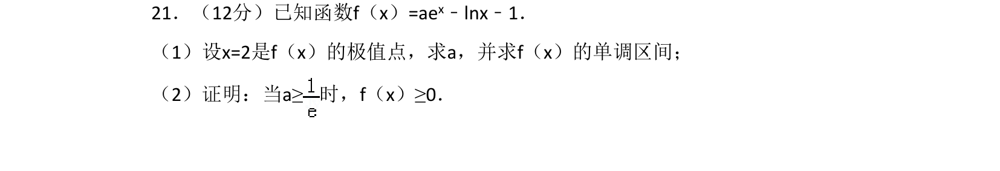
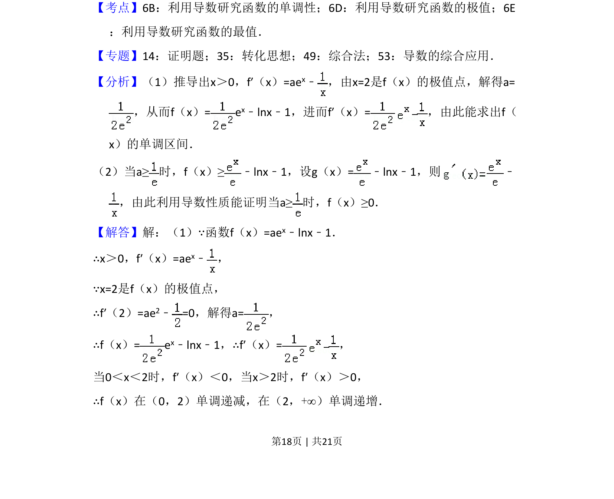
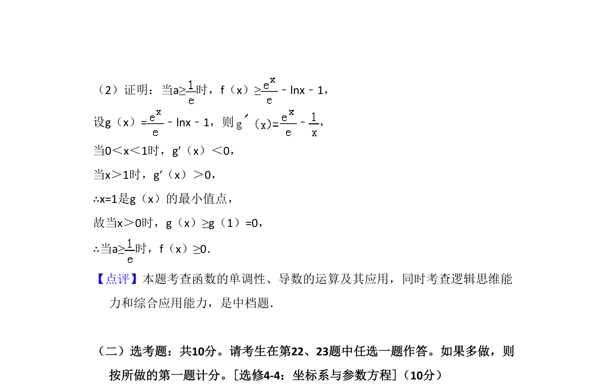

## 题面

## 摘要

已知含指数与对数的函数，利用极值点求参数并讨论单调区间，证明不等式恒成立。

## 关联考点

- [[705-利用导数研究函数的单调性|利用导数研究函数的单调性]]
- [[707-利用导数研究函数的极值|利用导数研究函数的极值]]
- [[706-利用导数研究函数的最值|利用导数研究函数的最值]]

## 答案与解析

> 📄 原 PDF 第 18 页：`素材/真题/湖南/2008-2024·（湖南）数学高考真题/2018年高考数学试卷（文）（新课标Ⅰ）（解析卷）.pdf`
