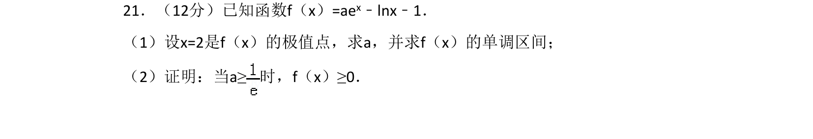
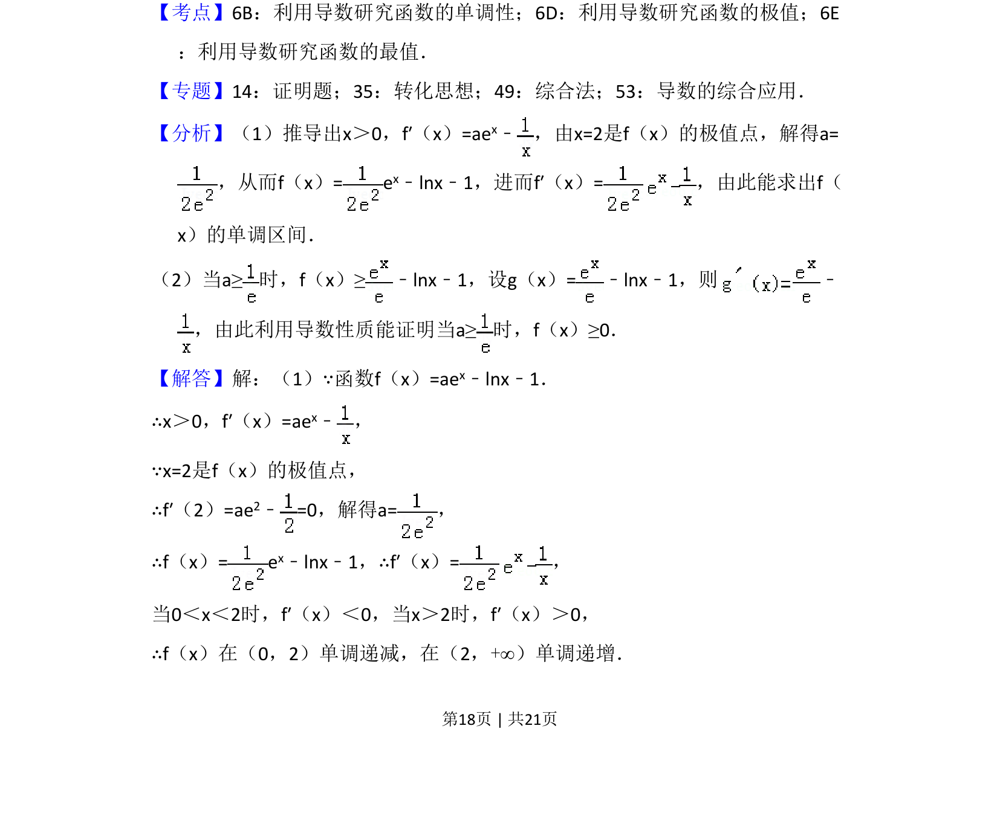
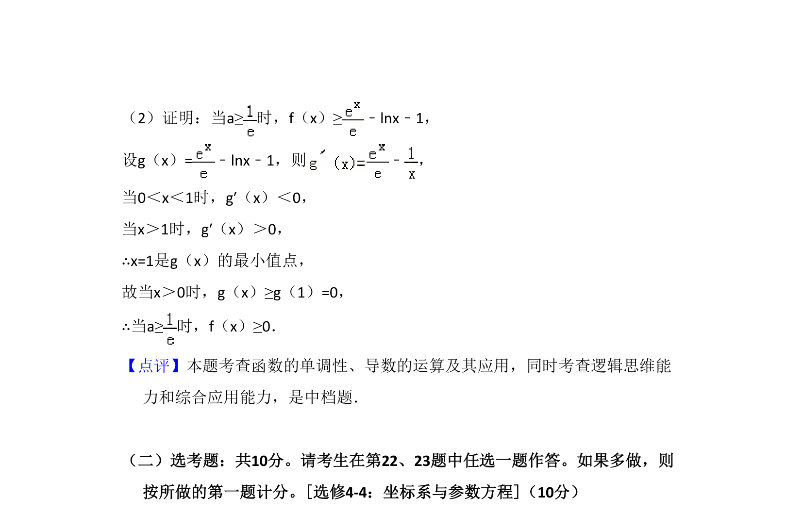

## 题面

## 摘要

已知含指数与对数的函数，利用极值点求参数并讨论单调区间，证明不等式恒成立。

## 关联考点

- [[705-利用导数研究函数的单调性|利用导数研究函数的单调性]]
- [[707-利用导数研究函数的极值|利用导数研究函数的极值]]
- [[706-利用导数研究函数的最值|利用导数研究函数的最值]]

## 答案与解析

> 📄 原 PDF 第 18 页：`素材/真题/湖南/2008-2024·（湖南）数学高考真题/2018年高考数学试卷（文）（新课标Ⅰ）（解析卷）.pdf`

<!-- 题干文本-start -->
## 题干文本
21．（12分）已知函数f（x）=aex﹣lnx﹣1．
（1）设x=2是f（x）的极值点，求a，并求f（x）的单调区间；
（2）证明：当a≥时，f（x）≥0．
<!-- 题干文本-end -->

<!-- 解析文本-start -->
## 解析文本
【考点】6B：利用导数研究函数的单调性；6D：利用导数研究函数的极值；6E
：利用导数研究函数的最值．菁优网版权所有
【专题】14：证明题；35：转化思想；49：综合法；53：导数的综合应用．
【分析】（1）推导出x＞0，f′（x）=aex﹣ ，由x=2是f（x）的极值点，解得a=
，从而f（x）= e x﹣lnx﹣1，进而f′（x）=，由此能求出f（
x）的单调区间．
（2）当a≥时，f（x）≥﹣lnx﹣1，设g（x）=﹣lnx﹣1，则 ﹣
，由此利用导数性质能证明当a≥时，f（x）≥0．
【解答】解：（1）∵函数f（x）=aex﹣lnx﹣1．
∴x＞0，f′（x）=aex﹣ ，
∵x=2是f（x）的极值点，
∴f′（2）=ae2﹣=0，解得a=，
∴f（x）= e x﹣lnx﹣1，∴f′（x）=，
当0＜x＜2时，f′（x）＜0，当x＞2时，f′（x）＞0，
∴f（x）在（0，2）单调递减，在（2，+∞）单调递增．
<!-- 解析文本-end -->
