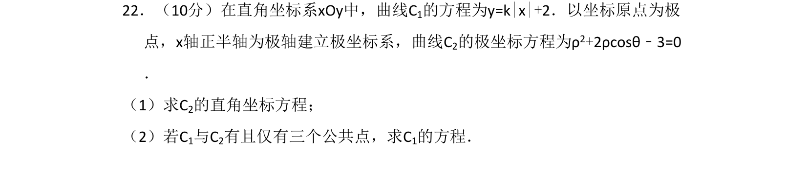
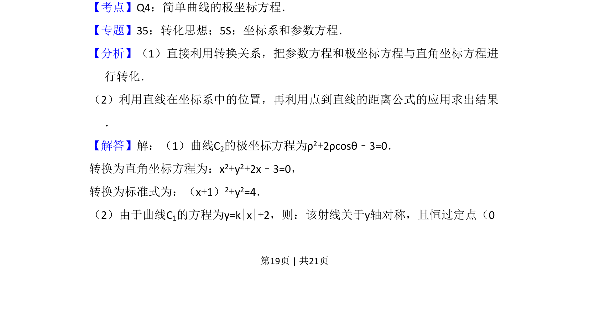
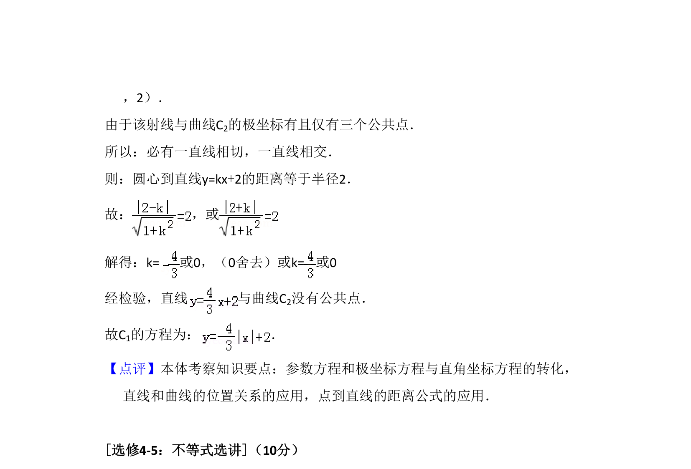

## 题面

## 摘要

曲线C₁含绝对值且过定点，C₂为圆；第一问极坐标化直角坐标，第二问根据三公共点求参数方程。

## 关联考点

- [[921-极坐标方程|极坐标方程]]
- [[1032-直角坐标方程|直角坐标方程]]
- [[585-绝对值函数|绝对值函数]]
- [[394-直线和圆位置关系-高中|直线与圆的位置关系]]

## 答案与解析

> 📄 原 PDF 第 19 页：`素材/真题/湖南/2008-2024·（湖南）数学高考真题/2018年高考数学试卷（文）（新课标Ⅰ）（解析卷）.pdf`
