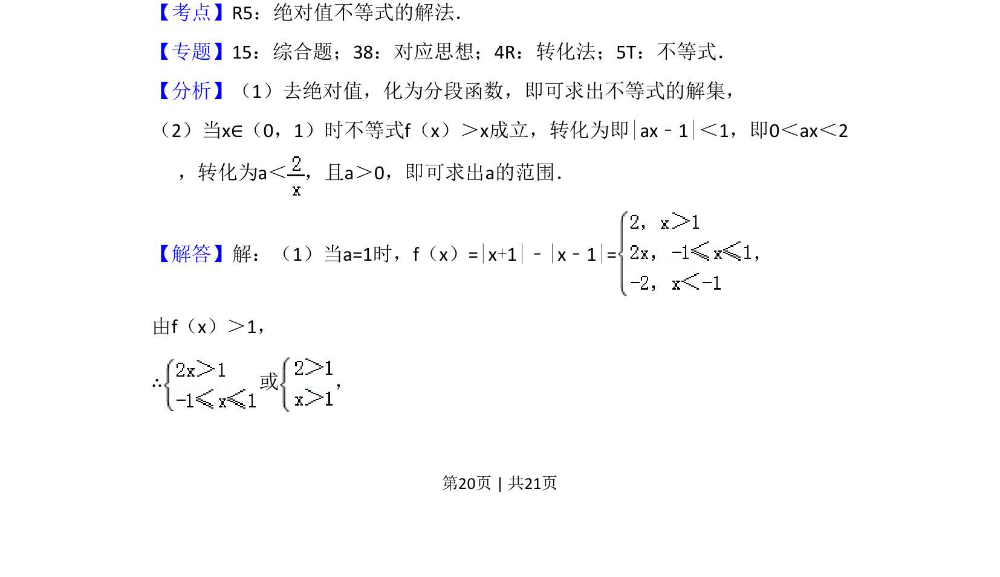
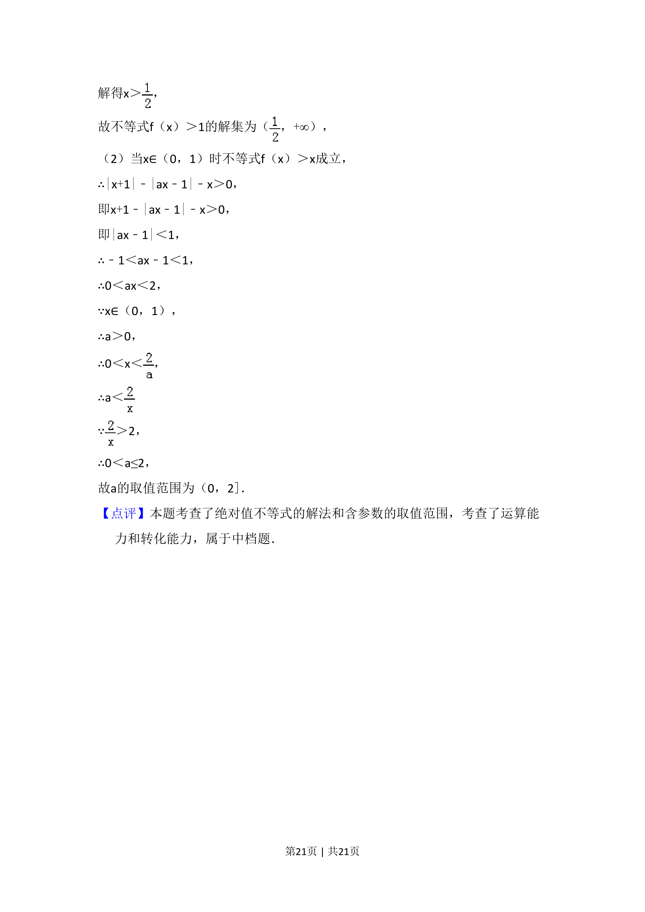

## 题面

## 摘要

考查含绝对值不等式的求解及根据不等式恒成立求参数范围，涉及分段函数与转化思想。

## 关联考点

- [[1094-绝对值不等式解法|绝对值不等式解法]]
- [[290-分段函数|分段函数]]
- [[531-不等式恒成立|不等式恒成立]]
- [[726-参数范围|参数范围]]

## 答案与解析

> 📄 原 PDF 第 20 页：`素材/真题/湖南/2008-2024·（湖南）数学高考真题/2018年高考数学试卷（文）（新课标Ⅰ）（解析卷）.pdf`
