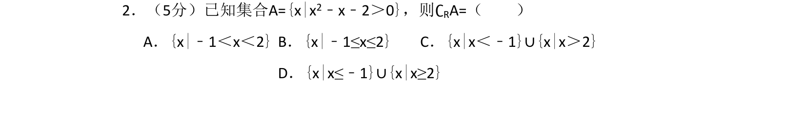
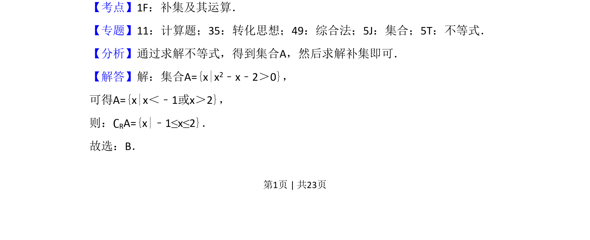
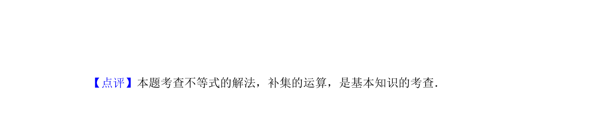

## 题面

## 摘要

通过解一元二次不等式求集合A，再求其在实数集上的补集。

## 关联考点

- [[267-一元二次不等式|一元二次不等式]]
- [[补集及其运算]]

## 答案与解析

> 📄 原 PDF 第 1 页：`素材/真题/湖南/2008-2024·（湖南）数学高考真题/2018年高考数学试卷（理）（新课标Ⅰ）（解析卷）.pdf`

<!-- 题干文本-start -->
## 题干文本
2．（5分）已知集合A={x|x2﹣x﹣2＞0}，则∁RA=（　　）
A．{x|﹣1＜x＜2}B．{x|﹣1≤x≤2}C．{x|x＜﹣1}∪{x|x＞2}
D．{x|x≤﹣1}∪{x|x≥2}
<!-- 题干文本-end -->

<!-- 解析文本-start -->
## 解析文本
【考点】1F：补集及其运算．菁优网版权所有
【专题】11：计算题；35：转化思想；49：综合法；5J：集合；5T：不等式．
【分析】通过求解不等式，得到集合A，然后求解补集即可．
【解答】解：集合A={x|x2﹣x﹣2＞0}，
可得A={x|x＜﹣1或x＞2}，
则：∁RA={x|﹣1≤x≤2}．
故选：B．
<!-- 解析文本-end -->
