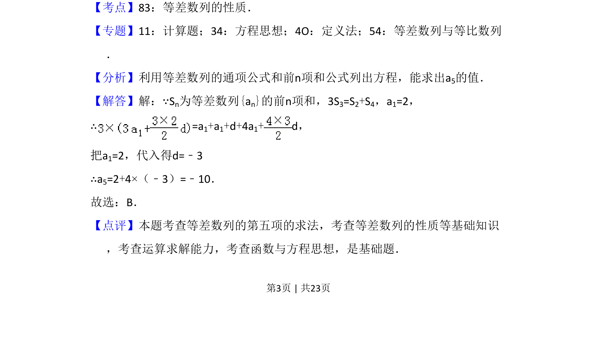

## 题面

## 摘要

等差数列中已知前n项和关系与首项，利用通项公式、前n项和公式列方程求公差，进而求第五项。

## 关联考点

- [[1063-等差数列通项公式|等差数列通项公式]]
- [[355-等差数列前n项和|等差数列前n项和]]
- [[906-方程思想|方程思想]]

## 答案与解析

> 📄 原 PDF 第 3 页：`素材/真题/湖南/2008-2024·（湖南）数学高考真题/2018年高考数学试卷（理）（新课标Ⅰ）（解析卷）.pdf`

<!-- 题干文本-start -->
## 题干文本
4．（5分）记Sn为等差数列{an}的前n项和．若3S3=S2+S4，a1=2，则a5=（　　）
A．﹣12 B．﹣10 C．10 D．12
<!-- 题干文本-end -->

<!-- 解析文本-start -->
## 解析文本
【考点】83：等差数列的性质．菁优网版权所有
【专题】11：计算题；34：方程思想；4O：定义法；54：等差数列与等比数列
．
【分析】利用等差数列的通项公式和前n项和公式列出方程，能求出a5的值．
【解答】解：∵Sn为等差数列{an}的前n项和，3S3=S2+S4，a1=2，
∴=a 1+a1+d+4a1+d，
把a1=2，代入得d=﹣3
∴a5=2+4×（﹣3）=﹣10．
故选：B．
【点评】本题考查等差数列的第五项的求法，考查等差数列的性质等基础知识
，考查运算求解能力，考查函数与方程思想，是基础题．
<!-- 解析文本-end -->
