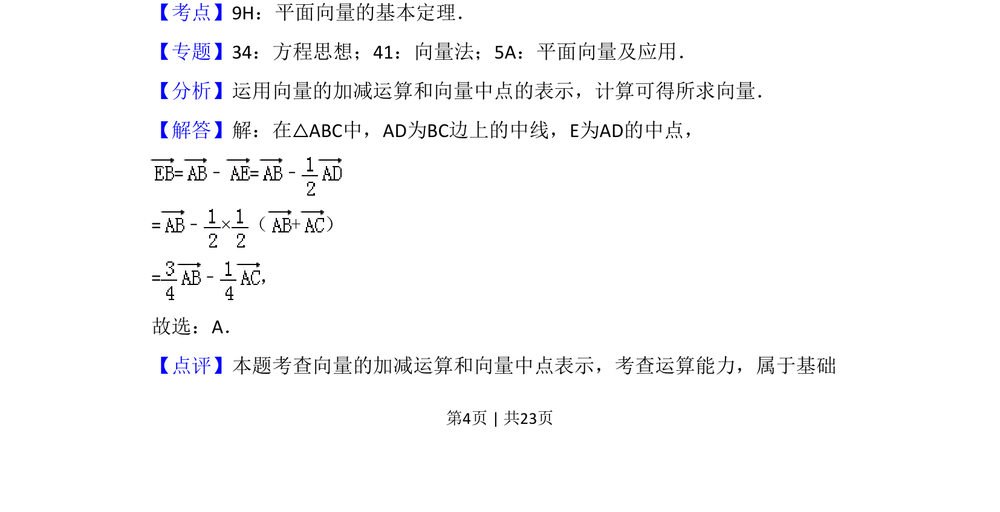

## 题面

## 摘要

考查平面向量的线性运算，利用中点关系表示目标向量。

## 关联考点

- [[336-平面向量基本定理|平面向量的基本定理]]
- [[1408-向量的加减运算|向量的加减运算]]
- [[中点向量表示]]

## 答案与解析

> 📄 原 PDF 第 4 页：`素材/真题/湖南/2008-2024·（湖南）数学高考真题/2018年高考数学试卷（理）（新课标Ⅰ）（解析卷）.pdf`

<!-- 题干文本-start -->
## 题干文本
6．（5分）在△ABC中，AD为BC边上的中线，E为AD的中点，则=（　　）
A． ﹣B． ﹣C．+D．+
<!-- 题干文本-end -->

<!-- 解析文本-start -->
## 解析文本
【考点】9H：平面向量的基本定理．菁优网版权所有
【专题】34：方程思想；41：向量法；5A：平面向量及应用．
【分析】运用向量的加减运算和向量中点的表示，计算可得所求向量．
【解答】解：在△ABC中，AD为BC边上的中线，E为AD的中点，
=﹣=﹣
=﹣×（+）
=﹣ ，
故选：A．
【点评】本题考查向量的加减运算和向量中点表示，考查运算能力，属于基础
<!-- 解析文本-end -->
