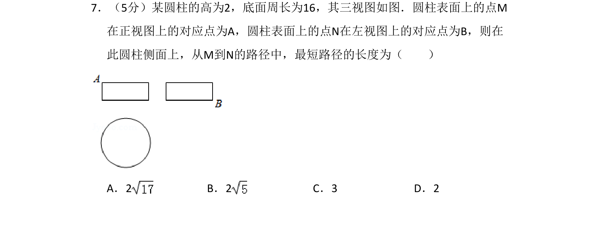
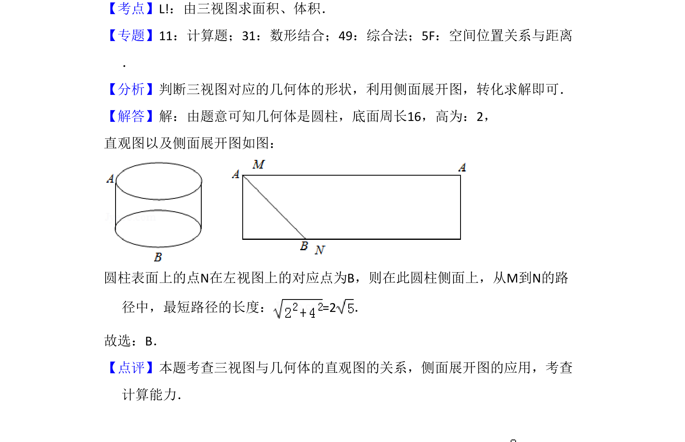

## 题面

## 摘要

根据三视图求圆柱表面上两点间最短路径，利用侧面展开图转化为平面线段长计算

## 关联考点

- [[235-三视图|三视图]]
- [[圆柱侧面积展开]]
- [[1411-最短路径|最短路径]]
- [[189-勾股定理|勾股定理]]

## 答案与解析

> 📄 原 PDF 第 5 页：`素材/真题/湖南/2008-2024·（湖南）数学高考真题/2018年高考数学试卷（理）（新课标Ⅰ）（解析卷）.pdf`
