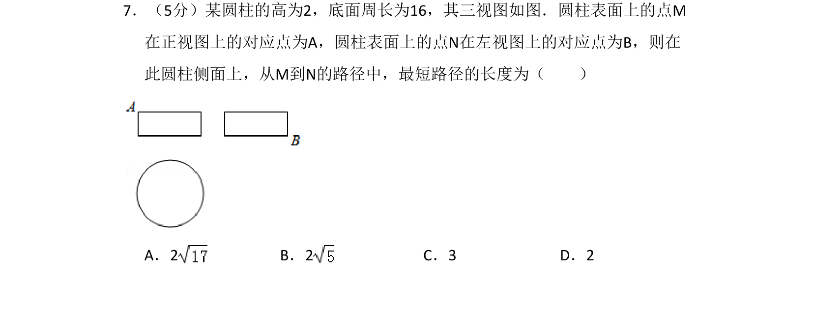
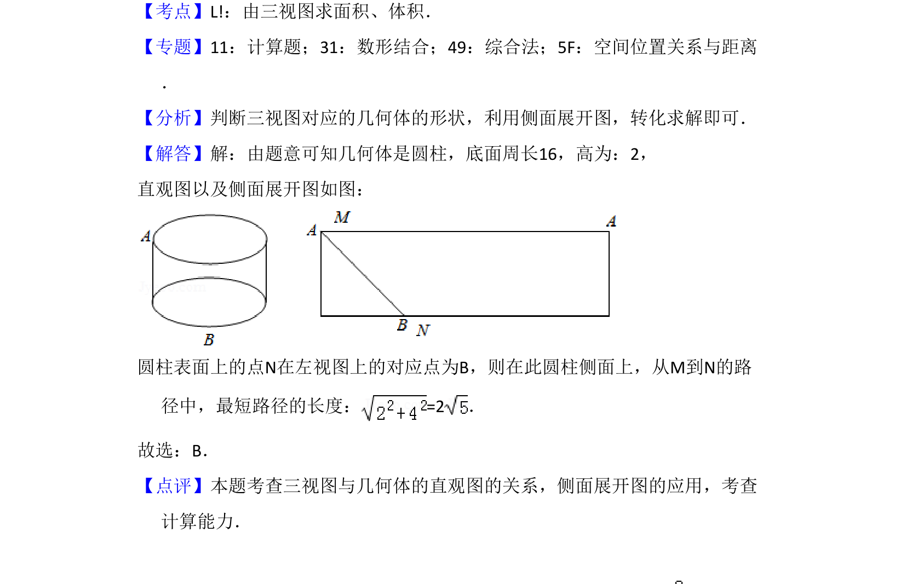

## 题面

## 摘要

根据三视图求圆柱表面上两点间最短路径，利用侧面展开图转化为平面线段长计算

## 关联考点

- [[235-三视图|三视图]]
- [[圆柱侧面积展开]]
- [[1411-最短路径|最短路径]]
- [[189-勾股定理|勾股定理]]

## 答案与解析

> 📄 原 PDF 第 5 页：`素材/真题/湖南/2008-2024·（湖南）数学高考真题/2018年高考数学试卷（理）（新课标Ⅰ）（解析卷）.pdf`

<!-- 题干文本-start -->
## 题干文本
7．（5分）某圆柱的高为2，底面周长为16，其三视图如图．圆柱表面上的点M
在正视图上的对应点为A，圆柱表面上的点N在左视图上的对应点为B，则在
此圆柱侧面上，从M到N的路径中，最短路径的长度为（　　）
A．2 B．2 C．3 D．2
<!-- 题干文本-end -->

<!-- 解析文本-start -->
## 解析文本
【考点】L!：由三视图求面积、体积．菁优网版权所有
【专题】11：计算题；31：数形结合；49：综合法；5F：空间位置关系与距离
．
【分析】判断三视图对应的几何体的形状，利用侧面展开图，转化求解即可．
【解答】解：由题意可知几何体是圆柱，底面周长16，高为：2，
直观图以及侧面展开图如图：
圆柱表面上的点N在左视图上的对应点为B，则在此圆柱侧面上，从M到N的路
径中，最短路径的长度：=2．
故选：B．
【点评】本题考查三视图与几何体的直观图的关系，侧面展开图的应用，考查
计算能力．
<!-- 解析文本-end -->
