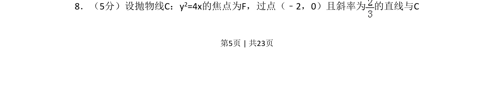
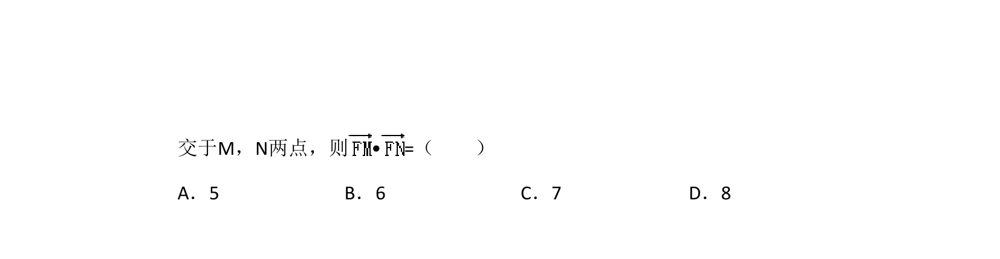
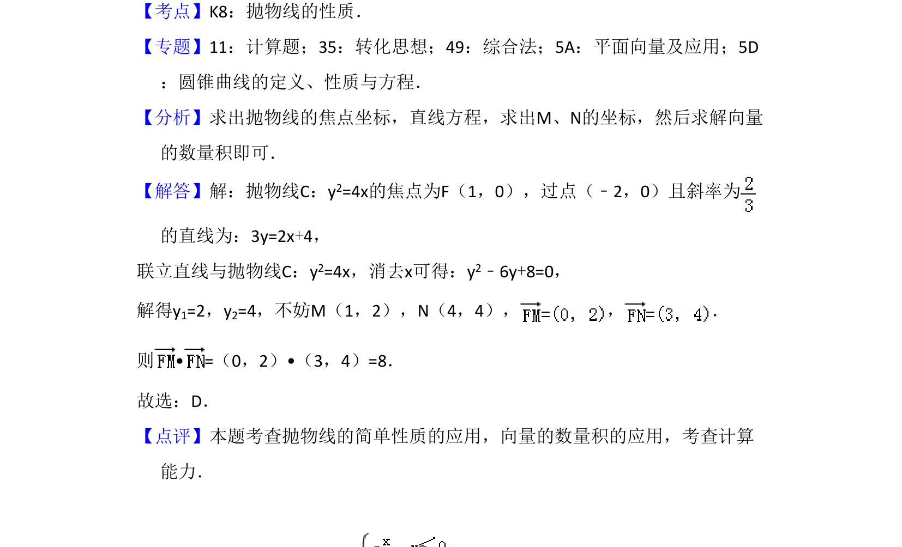

## 题面

## 摘要

过定点直线与抛物线相交，求与焦点相关的几何量或方程。

## 关联考点

- [[227-抛物线|抛物线]]
- [[1005-直线与圆锥曲线位置关系|直线与圆锥曲线位置关系]]
- [[037-焦点焦距|焦点]]

## 答案与解析

> 📄 原 PDF 第 5 页：`素材/真题/湖南/2008-2024·（湖南）数学高考真题/2018年高考数学试卷（理）（新课标Ⅰ）（解析卷）.pdf`
