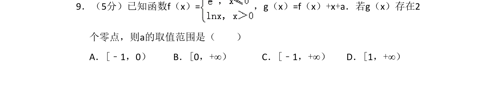
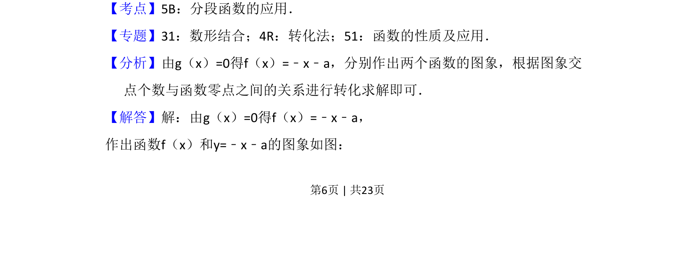
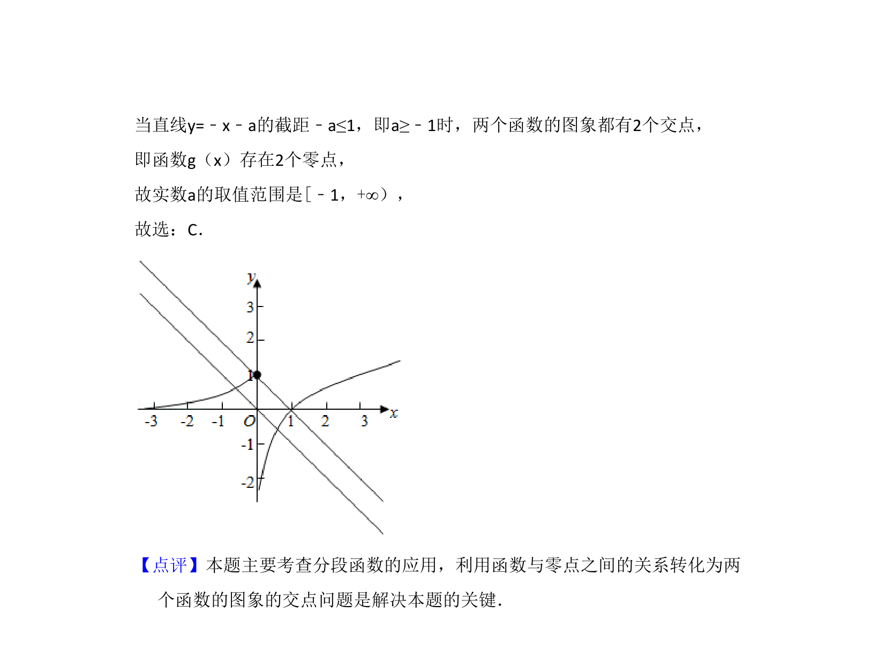

## 题面

## 摘要

已知分段函数，通过两函数图象交点个数与零点关系求参数范围。

## 关联考点

- [[290-分段函数|分段函数]]
- [[288-函数零点|函数零点]]
- [[897-数形结合|数形结合]]
- [[726-参数范围|参数范围]]

## 答案与解析

> 📄 原 PDF 第 6 页：`素材/真题/湖南/2008-2024·（湖南）数学高考真题/2018年高考数学试卷（理）（新课标Ⅰ）（解析卷）.pdf`
