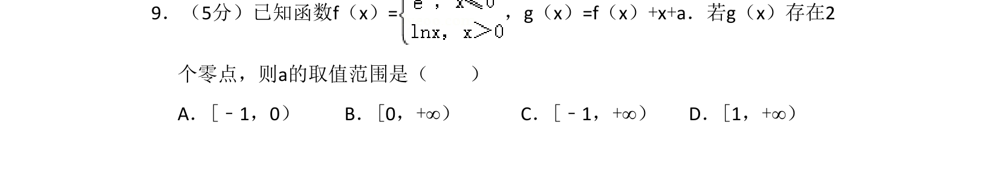
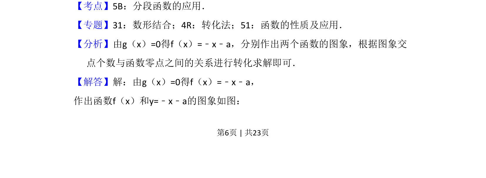
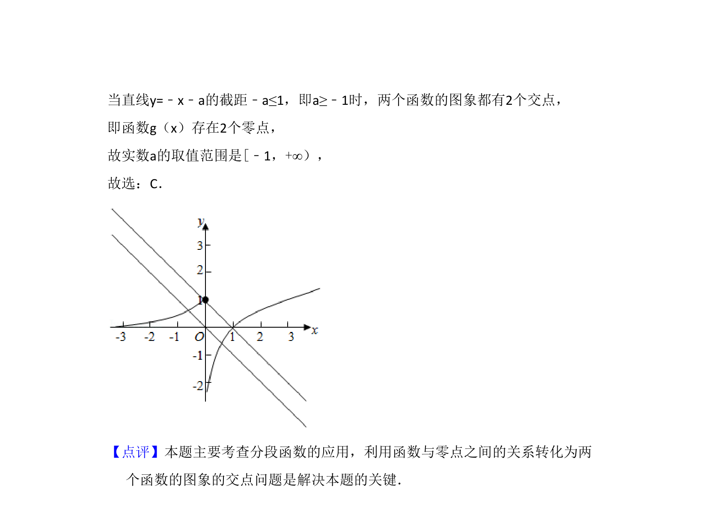

## 题面

## 摘要

已知分段函数，通过两函数图象交点个数与零点关系求参数范围。

## 关联考点

- [[290-分段函数|分段函数]]
- [[288-函数零点|函数零点]]
- [[897-数形结合|数形结合]]
- [[726-参数范围|参数范围]]

## 答案与解析

> 📄 原 PDF 第 6 页：`素材/真题/湖南/2008-2024·（湖南）数学高考真题/2018年高考数学试卷（理）（新课标Ⅰ）（解析卷）.pdf`

<!-- 题干文本-start -->
## 题干文本
9．（5分）已知函数f（x）=，g（x）=f（x）+x+a．若g（x）存在2
个零点，则a的取值范围是（　　）
A．[﹣1，0）B．[0，+∞）C．[﹣1，+∞）D．[1，+∞）
<!-- 题干文本-end -->

<!-- 解析文本-start -->
## 解析文本
【考点】5B：分段函数的应用．菁优网版权所有
【专题】31：数形结合；4R：转化法；51：函数的性质及应用．
【分析】由g（x）=0得f（x）=﹣x﹣a，分别作出两个函数的图象，根据图象交
点个数与函数零点之间的关系进行转化求解即可．
【解答】解：由g（x）=0得f（x）=﹣x﹣a，
作出函数f（x）和y=﹣x﹣a的图象如图：
<!-- 解析文本-end -->
