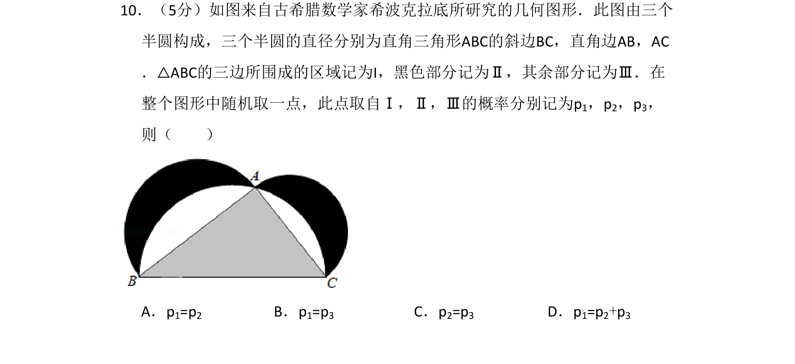
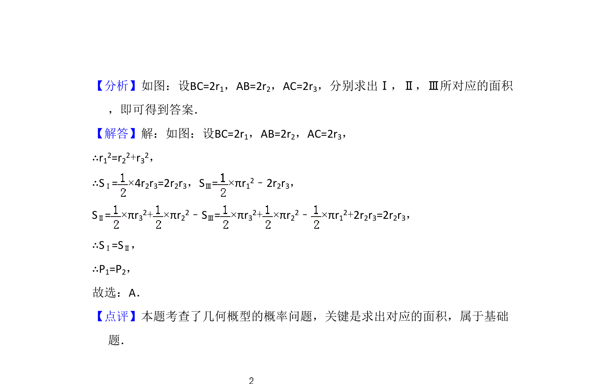

## 题面

## 摘要

该题考查以直角三角形三边为直径的半圆构成的几何图形中，计算各区域面积比及几何概型概率。

## 关联考点

- [[667-几何概型|几何概型]]
- [[1146-面积计算|面积计算]]
- [[189-勾股定理|勾股定理]]

## 答案与解析

> 📄 原 PDF 第 7 页：`素材/真题/湖南/2008-2024·（湖南）数学高考真题/2018年高考数学试卷（理）（新课标Ⅰ）（解析卷）.pdf`
