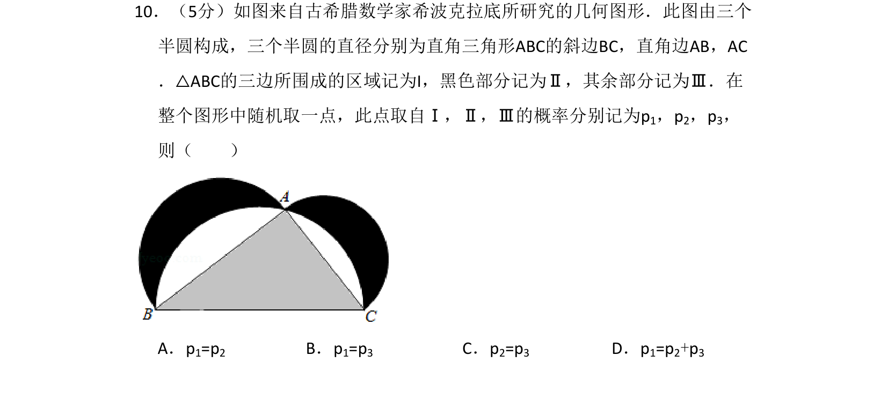
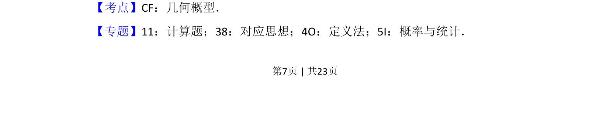
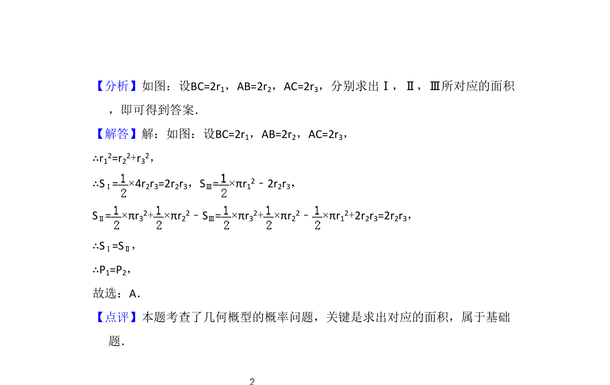

## 题面

## 摘要

该题考查以直角三角形三边为直径的半圆构成的几何图形中，计算各区域面积比及几何概型概率。

## 关联考点

- [[667-几何概型|几何概型]]
- [[1146-面积计算|面积计算]]
- [[189-勾股定理|勾股定理]]

## 答案与解析

> 📄 原 PDF 第 7 页：`素材/真题/湖南/2008-2024·（湖南）数学高考真题/2018年高考数学试卷（理）（新课标Ⅰ）（解析卷）.pdf`

<!-- 题干文本-start -->
## 题干文本
10．（5分）如图来自古希腊数学家希波克拉底所研究的几何图形．此图由三个
半圆构成，三个半圆的直径分别为直角三角形ABC的斜边BC，直角边AB，AC
．△ABC的三边所围成的区域记为I，黑色部分记为Ⅱ，其余部分记为Ⅲ．在
整个图形中随机取一点，此点取自Ⅰ，Ⅱ，Ⅲ的概率分别记为p1，p2，p3，
则（　　）
A．p1=p2 B．p1=p3 C．p2=p3 D．p1=p2+p3
<!-- 题干文本-end -->

<!-- 解析文本-start -->
## 解析文本
【考点】CF：几何概型．菁优网版权所有
【专题】11：计算题；38：对应思想；4O：定义法；5I：概率与统计．
<!-- 解析文本-end -->
