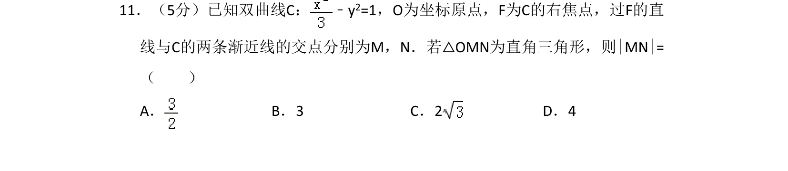
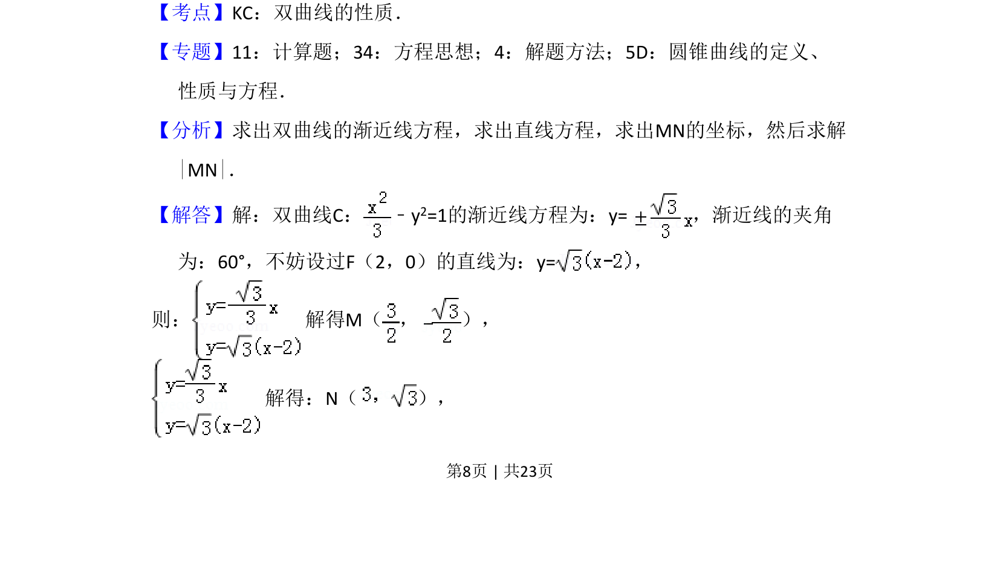
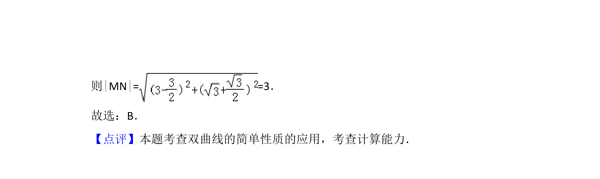

## 题面

## 摘要

已知双曲线与过焦点的直线，由渐近线与直角条件求弦长。

## 关联考点

- [[731-双曲线的性质|双曲线的性质]]
- [[975-渐近线方程|渐近线方程]]
- [[直线与圆锥曲线的交点]]
- [[869-弦长计算|弦长计算]]

## 答案与解析

> 📄 原 PDF 第 8 页：`素材/真题/湖南/2008-2024·（湖南）数学高考真题/2018年高考数学试卷（理）（新课标Ⅰ）（解析卷）.pdf`
