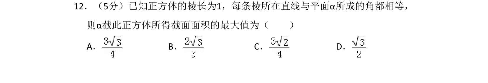
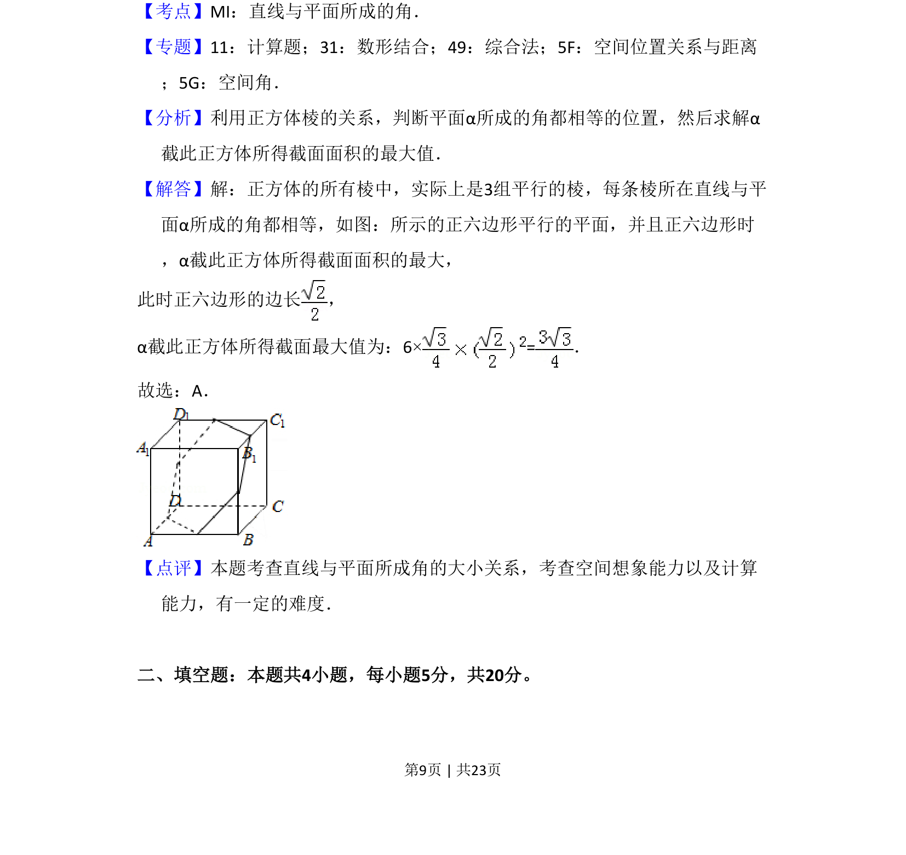

## 题面

## 摘要

正方体中所有棱与平面α成等角时，截面面积最大值的求解问题。

## 关联考点

- [[1013-直线与平面所成的角|直线与平面所成的角]]
- [[正方体的截面]]
- [[1144-面积最值|面积最值]]

## 答案与解析

> 📄 原 PDF 第 9 页：`素材/真题/湖南/2008-2024·（湖南）数学高考真题/2018年高考数学试卷（理）（新课标Ⅰ）（解析卷）.pdf`

<!-- 题干文本-start -->
## 题干文本
12．（5分）已知正方体的棱长为1，每条棱所在直线与平面α所成的角都相等，
则α截此正方体所得截面面积的最大值为（　　）
A．B．C．D．
<!-- 题干文本-end -->

<!-- 解析文本-start -->
## 解析文本
【考点】MI：直线与平面所成的角．菁优网版权所有
【专题】11：计算题；31：数形结合；49：综合法；5F：空间位置关系与距离
；5G：空间角．
【分析】利用正方体棱的关系，判断平面α所成的角都相等的位置，然后求解α
截此正方体所得截面面积的最大值．
【解答】解：正方体的所有棱中，实际上是3组平行的棱，每条棱所在直线与平
面α所成的角都相等，如图：所示的正六边形平行的平面，并且正六边形时
，α截此正方体所得截面面积的最大，
此时正六边形的边长 ，
α截此正方体所得截面最大值为：6×=．
故选：A．
【点评】本题考查直线与平面所成角的大小关系，考查空间想象能力以及计算
能力，有一定的难度．
　
二、填空题：本题共4小题，每小题5分，共20分。
<!-- 解析文本-end -->
